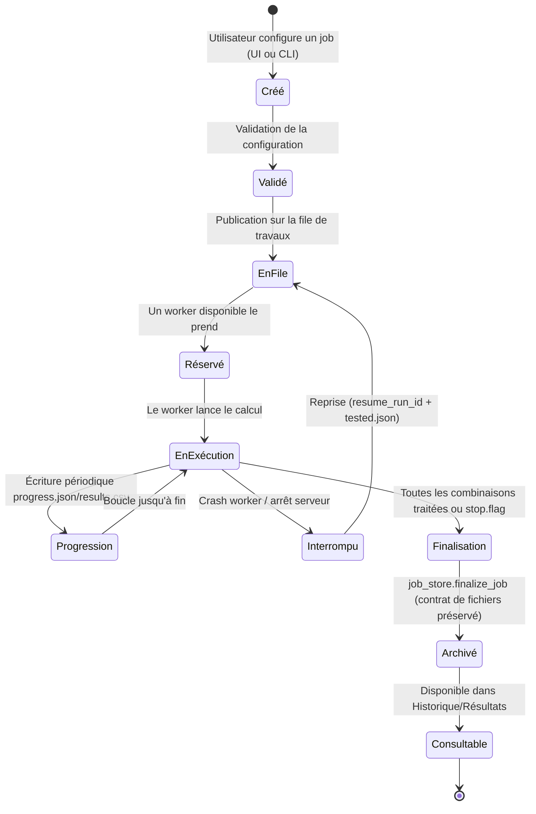
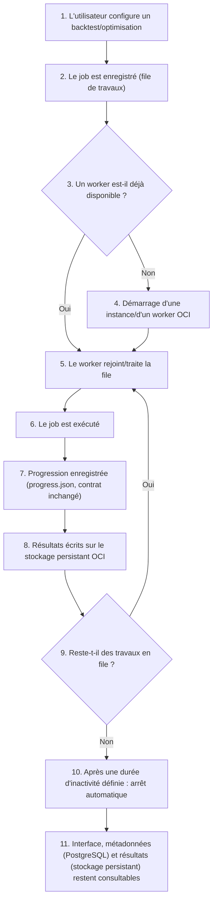

# Calcul distribué et architecture de la file de jobs

> Voir `docs/INDEX.md` pour la navigation. Décision technologique de la file :
> [ADR 0006](../adr/0006-job-queue-technology.md) (`Decision pending`). Modèle d'exécution
> général : [ADR 0005](../adr/0005-modular-monolith-with-separated-workers.md). Ce document
> compare les options et décrit le cycle de vie cible d'un job.

## 1. Comparaison des options de file de travaux

| Critère | Système actuel (subprocess local) | Multiprocessing local seul | Redis + RQ | Redis + Celery |
|---|---|---|---|---|
| Complexité de mise en place | Déjà en place | Faible | Faible-moyenne | Moyenne-élevée |
| Fiabilité / reprise après crash | Mécanisme moteur dormant (non déclenché) | Idem | Bonne (job persistant en Redis) | Bonne, plus de garanties (retries) |
| Suivi de progression | Fichiers `progress.json` (déjà fiable) | Idem | Intégré (statut de job) + fichiers conservés | Intégré, plus riche (états personnalisés) |
| Annulation | `stop.flag` (déjà fonctionnel) | Idem | Supportée | Supportée |
| Priorité | Absente (1 seul job) | Absente | Supportée (files multiples) | Supportée, plus fine |
| Jobs récurrents | Absents | Absents | Limité | Supporté nativement (Celery beat) |
| Distribution multi-machines | Absente | Absente | Oui | Oui |
| Compatibilité Windows (dev) / Linux (serveur) | Oui (déjà testé) | Oui | Oui (Redis serveur Linux, client cross-OS) | Oui |
| Observabilité | Fichiers + logs texte | Idem | Bonne (dashboard RQ) | Très bonne (Flower) |
| Coût de maintenance | Faible (déjà stable) | Faible | Faible-moyen | Moyen-élevé |

**Décision** : voir ADR 0006 — prototype requis avant de choisir entre RQ et Celery ; le système
actuel (subprocess local) reste la référence de repli tant que la migration n'est pas validée.

## 2. Cycle de vie cible d'un job

Le contrat de fichiers (`progress.json`, `config_used.json`, `results.csv`, `tested.json`,
`meta.json`, `stop.flag`, `metrics.json`, `best_strategies.csv`, `report.html`, `logs.txt`,
`archive.zip`, `data_manifest.json`) est **identique**, que le job soit lancé en local
(`subprocess.Popen` actuel) ou via la future file de travaux — seul le mécanisme de déclenchement
et de distribution change.

## 3. Concurrence — décision à revisiter explicitement

Aujourd'hui : **un seul job actif à la fois**, imposé par `job_launcher.assert_no_active_jobs()`.
C'est une contrainte d'application, pas une limite technique du moteur. La cible multi-workers
suppose de lever cette contrainte **au niveau orchestration**, tout en gardant un contrôle
explicite du nombre de jobs simultanés (pour ne pas saturer le serveur) — paramètre à définir en
Phase 1, pas une suppression pure et simple du verrou.

## 4. Reprise après interruption — ce qui existe déjà

`OptimizationConfig.resume_run_id` (`optimizer.py`) et `tested.json`
(`optimization_store.save_tested_hashes`/`load_tested_hashes`) permettent déjà de sauter les
combinaisons déjà testées **si `resume_run_id` est fourni**. Aucune UI ni CLI ne l'expose
aujourd'hui, et rien ne détecte automatiquement un job mort (pas de PID stocké, pas de
watchdog). La cible :
1. La file de travaux détecte un worker mort (mécanisme natif RQ/Celery, voir ADR 0006).
2. Le job repasse en file avec `resume_run_id` déjà renseigné automatiquement.
3. Aucune intervention manuelle requise pour les cas courants (crash worker, redémarrage serveur).

## 5. Ce qui ne change pas

Le mode "backtest simple" synchrone en process n'est pas nécessairement migré vers la file de
travaux dans un premier temps — décision ouverte, voir `docs/roadmap/DECISION_BACKLOG.md`. Le
moteur (`engine.py`, `optimizer.py`, `scoring.py`) ne change pas de responsabilité : seul le
mécanisme de déclenchement et de distribution évolue.

## 6. Cycle de fonctionnement à la demande (workers OCI) — cible architecturale, non implémentée

Conséquence directe d'[ADR 0015](../adr/0015-oracle-cloud-infrastructure-payg.md) : les workers
de calcul ne tournent pas en permanence, contrairement à un serveur dédié classique. Ce cycle
respecte le principe de conception "calcul éphémère vs stockage persistant" de
[`DEPLOYMENT_ARCHITECTURE.md`](DEPLOYMENT_ARCHITECTURE.md) : le worker ne détient jamais une
donnée qui n'existerait qu'en lui.

Points de conception explicites (voir `SECURITY_AND_OPERATIONS.md` §7 pour le détail des
protections de coût associées) :

- L'étape 10 (arrêt automatique) **doit vérifier l'absence de travail en file/en cours** avant de
  couper une instance — jamais un simple minuteur aveugle.
- L'étape 8 écrit sur le **stockage persistant**, jamais sur un disque local à l'instance de
  calcul — sinon l'étape 10 perdrait des données à l'arrêt (violerait le principe de conception
  ci-dessus).
- L'étape 4 (démarrage) et l'étape 10 (arrêt) sont les points où les protections de coût
  s'appliquent : nombre maximal de workers simultanés, nombre maximal de vCPU autorisés, durée
  maximale d'un job avant arrêt forcé.
- Ce cycle est une **cible architecturale, non implémentée dans cette mission** — le mécanisme
  exact de démarrage/arrêt (API OCI, script planifié, autre) reste une décision ouverte
  (`docs/roadmap/DECISION_BACKLOG.md`).
