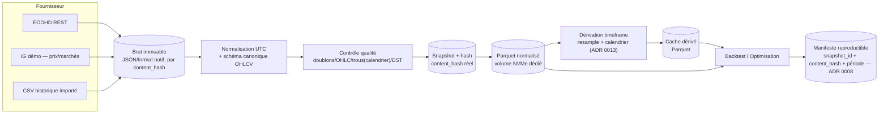
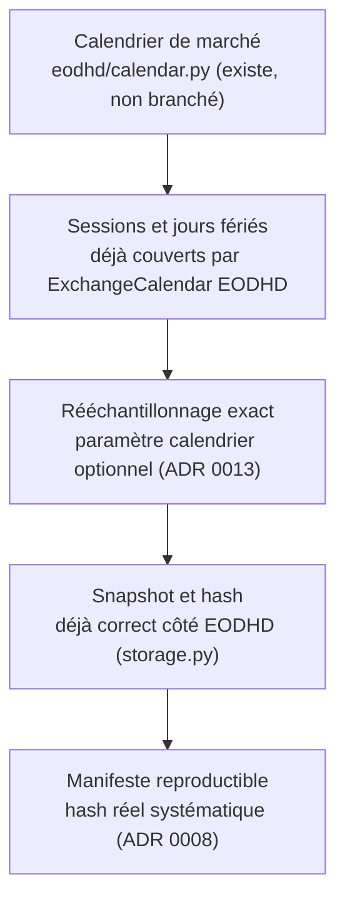

# Architecture des données

> Voir `docs/INDEX.md` pour la navigation. Stratégie de stockage : ADR 0008. Intégration du
> calendrier : ADR 0013. Ce document décrit la fin du pipeline Data Center et le flux complet.
> Sur OCI ([ADR 0015](../adr/0015-oracle-cloud-infrastructure-payg.md)), toutes les données
> décrites ici vivent sur le **stockage persistant**, jamais sur le disque local d'une instance
> de calcul éphémère — voir le principe de conception dans
> [`DEPLOYMENT_ARCHITECTURE.md`](DEPLOYMENT_ARCHITECTURE.md) : l'arrêt automatique ou manuel d'un
> worker ne doit jamais faire perdre une donnée listée dans ce document.

## 1. Diagramme du flux de données cible

Différence clé avec l'état actuel (voir `CURRENT_STATE.md` §4) : **tout** chemin (EODHD ou CSV
local) produit un `content_hash` réel relié au manifeste — aujourd'hui seul EODHD le calcule, et
même ce hash n'atteint jamais le manifeste de backtest.

## 2. Fin du pipeline Data Center — ce qui reste à faire (sans l'implémenter ici)

- Téléchargement EODHD incrémental (aujourd'hui : toujours période complète redemandée).
- Reprise après interruption d'un téléchargement (aujourd'hui : échec global sans checkpoint).
- Suivi de quota cumulatif côté client (aujourd'hui : statut interrogé à la demande seulement).
- Synchronisation incrémentale (aujourd'hui : absente).
- Contrôle de doublons/trous : doublons déjà couverts ; trous nécessitent le branchement du
  calendrier (ADR 0013).
- Catalogue multi-actifs complet : le port `MarketDataSource` et `data/{ASSET}/{TIMEFRAME}/`
  existent déjà, mais `catalog.py`'s persistance JSON est du code mort — cible : catalogue dans
  PostgreSQL (ADR 0007), plus de fichier JSON silencieusement obsolète.
- Dividendes/splits : connecteurs déjà écrits (`eodhd/normalize.py`, `eodhd/client.py`) mais
  zéro appelant en production — cible : brancher au pipeline de normalisation, hors du schéma
  canonique OHLCV (conserver ADR 0002), stockés séparément et appliqués explicitement si demandé.
- Titres radiés : `list_exchange_symbols(delisted=True)` existe déjà, jamais appelé — cible :
  intégrer au catalogue pour marquer un instrument comme radié plutôt que le faire disparaître
  silencieusement.
- Stockage brut immuable : déjà vrai côté EODHD, à étendre au CSV local (hash à la lecture).
- Snapshots reproductibles : `SnapshotManifest` déjà correct côté EODHD — à relier au manifeste
  de backtest (ADR 0008).
- Vérification périodique de l'intégrité des Parquet : à spécifier (checksum périodique,
  détection de corruption silencieuse) — non implémentée aujourd'hui.

## 3. Calendrier de marché, sessions, DST, jours fériés

Voir ADR 0013 pour la décision d'intégration progressive. Ordre cible :

DST : non couvert aujourd'hui par `quality.py` ni par `eodhd/calendar.py` d'après l'audit — à
spécifier explicitement lors du branchement (ADR 0013), pas supposé résolu.

## 4. Emplacement des données — répartition cible

| Donnée | Emplacement cible | Aujourd'hui |
|---|---|---|
| Brut immuable (JSON) | Système de fichiers (volume NVMe) | Déjà le cas pour EODHD |
| Normalisé / dérivé (Parquet) | Système de fichiers (volume NVMe) | Partiel — CSV encore pour le cache dérivé et les sources locales |
| Manifestes de backtest | Fichier JSON dans le job directory (contrat préservé) + index dans PostgreSQL | Fichier JSON seul, champs vides |
| Catalogue d'instruments/fournisseurs | PostgreSQL (ADR 0007) | JSON mort (`settings/data_catalog.json`) |
| Registre IG (produits, spreads historisés) | PostgreSQL | Absent |
| Artefacts de job (résultats) | Système de fichiers (job directory, contrat préservé) | Déjà le cas |

## 5. Traitement séparé par type de données

- **Données EODHD** : pipeline `raw → normalized (Parquet) → derived`, déjà structuré, à
  compléter (incrémental, reprise, quota, calendrier).
- **Données IG** : aujourd'hui interrogées à la demande, non persistées. Cible : registre de
  produits + historisation des spreads/horaires en PostgreSQL, distinct du pipeline EODHD
  (IG reste une source d'appoint récente, pas historique longue durée — voir feuille de route
  utilisateur).
- **Données CSV importées** : compatibilité préservée, hash ajouté à la lecture (ADR 0008), pas
  de migration forcée du format existant.
- **Données options** : traitées comme un sous-système séparé (ADR 0011), jamais mélangées au
  pipeline spot ci-dessus.
- **Données théoriques** (reconstruites, ex. options valorisées par modèle) : toujours étiquetées
  explicitement comme telles, jamais confondues avec des données réelles dans un manifeste.

## 6. Politique de rétention et migration des anciennes données

Aucune migration forcée des CSV historiques déjà présents (`nasdaq_3m.csv`,
`data/{ASSET}/{TIMEFRAME}/`) — ils restent lisibles tels quels. La politique de rétention précise
(durée de conservation du brut EODHD, des snapshots, des job directories anciens) est une
décision ouverte — voir `docs/roadmap/DECISION_BACKLOG.md`.
