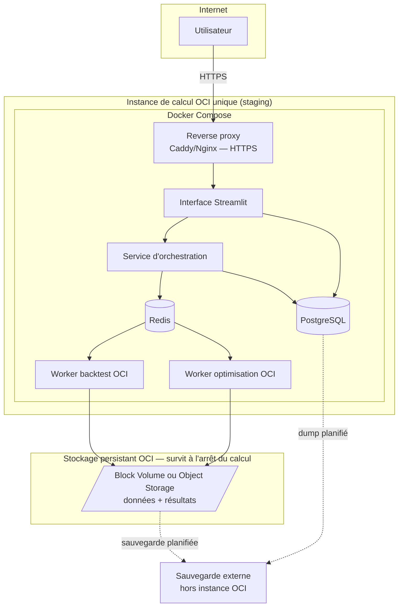
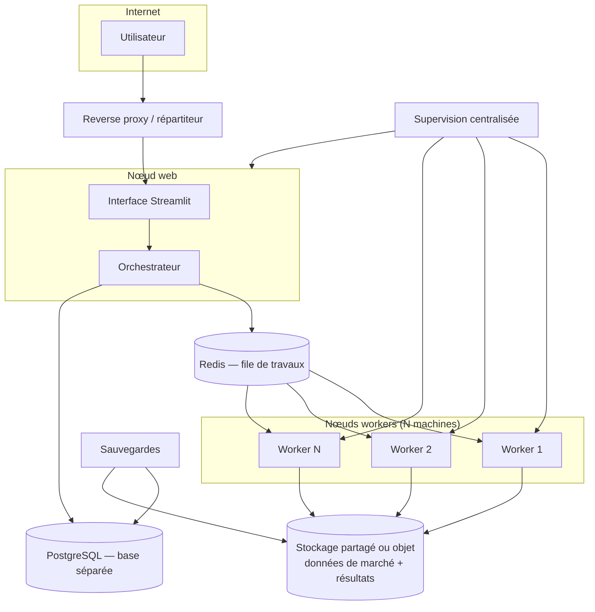

# Architecture de déploiement

> Voir `docs/INDEX.md` pour la navigation. Le dimensionnement précis et les prix sont dans
> [`BENCHMARK_PLAN.md`](../roadmap/BENCHMARK_PLAN.md) (à vérifier via WebSearch/WebFetch au
> moment de la commande, jamais figés ici). Ce document décrit la **structure**, pas les tarifs.
> Décisions associées : [ADR 0015](../adr/0015-oracle-cloud-infrastructure-payg.md) (Oracle
> Cloud Infrastructure PAYG, cible principale), [ADR 0009](../adr/0009-docker-compose-for-staging.md)
> (Docker Compose), [ADR 0012](../adr/0012-environments-local-staging-production.md)
> (environnements).

## Principe de conception : calcul éphémère vs stockage persistant

Cette architecture applique un **seam** explicite (vocabulaire `codebase-design`) entre deux
modules aux propriétés opposées, imposé par le modèle à la demande d'OCI (ADR 0015) :

- **Calcul éphémère** — l'instance/les workers OCI. Interface volontairement mince : consommer un
  travail, écrire via l'interface du stockage persistant, s'arrêter. Test de suppression : détruire
  cette instance ne doit **jamais** faire disparaître une donnée qui n'existerait qu'en elle.
- **Stockage persistant** — Block Volume/Object Storage + PostgreSQL + sauvegardes. Module
  profond : toute la complexité de durabilité reste cachée derrière une interface simple pour les
  workers. Test de suppression inverse : détruire ce module ferait perdre des données réelles —
  c'est le signe qu'il porte légitimement la persistance.

Conséquence directe : **l'arrêt d'une instance de calcul OCI (automatique après inactivité ou
manuel) ne doit jamais provoquer la perte** de données EODHD, IG, Parquet, snapshots, catalogues,
manifestes, résultats, rapports, configurations, PostgreSQL, ou sauvegardes — voir détail par
type de donnée dans [`DATA_ARCHITECTURE.md`](DATA_ARCHITECTURE.md) et le cycle de démarrage/arrêt
dans [`COMPUTE_AND_JOBS.md`](COMPUTE_AND_JOBS.md) §6.

## Niveau 1 — instance OCI unique de staging (Phase 1)

Caractéristiques : une seule instance OCI pour la première version, tous les services en
conteneurs (Docker Compose), stockage persistant OCI **séparé du cycle de vie de l'instance de
calcul** (Block Volume/Object Storage, jamais recréé avec l'instance), sauvegarde externe (hors
instance) planifiée. Objectif : reproductible en un temps borné depuis GitHub + ce
`docker-compose.yml` (à créer en Phase 1, pas dans cette mission) + le stockage persistant déjà
existant.

## Niveau 2 — architecture évolutive (si le besoin réel apparaît)

Différence clé avec le niveau 1 : PostgreSQL et le stockage de données sortent du nœud web,
plusieurs nœuds workers OCI peuvent être ajoutés/retirés indépendamment (y compris un worker
temporaire plus puissant pour une grosse campagne, arrêté immédiatement après — voir
`COMPUTE_AND_JOBS.md` §6), une supervision centralisée couvre tous les nœuds. **Non engagé** —
voir `docs/roadmap/DECISION_BACKLOG.md` : ce niveau n'est construit que si un besoin réel de
plusieurs machines workers simultanées apparaît après la Phase 1. Le niveau 1 permet déjà, sans
le construire, d'évoluer vers ce niveau : le stockage persistant est conçu dès le niveau 1 comme
indépendant du cycle de vie du calcul (voir principe de conception ci-dessus), et toute instance
(web ou worker) doit pouvoir être **reconstruite depuis GitHub + le stockage persistant/les
sauvegardes**, sans état irremplaçable local à l'instance elle-même.

## Profils serveur (structure — chiffres/tarifs dans `BENCHMARK_PLAN.md`)

Trois profils à instancier après benchmark, jamais choisis a priori (détail complet et formes
OCI dans [`BENCHMARK_PLAN.md`](../roadmap/BENCHMARK_PLAN.md) §2-3) :
1. **Minimal** — 4-8 vCPU/16-32 Go — valider que le pipeline complet tourne sur l'instance OCI.
2. **Recommandé** — 8-16 vCPU/32-64 Go — dimensionnement pour les optimisations intermédiaires,
   à confirmer par benchmark.
3. **Intensif temporaire** — puissance supérieure, activée uniquement pour une grosse campagne
   sur une forme flexible OCI, arrêt immédiat après (voir contrôle des coûts,
   `SECURITY_AND_OPERATIONS.md` §7).

Sur OCI, ces trois profils sont des points de dimensionnement d'une même forme flexible
(`VM.Standard.E5.Flex` recommandé — voir `BENCHMARK_PLAN.md` §5 pour la posture AMD vs ARM), pas
trois machines différentes à choisir a priori.

## Reverse proxy

Caddy ou Nginx — choix technique non tranché ici (voir `docs/roadmap/DECISION_BACKLOG.md`).
Caddy offre HTTPS automatique par défaut (plus simple pour un serveur unique) ; Nginx est plus
répandu et plus configurable pour des besoins avancés. À trancher en Phase 1 sans bloquer le
reste de l'architecture.

## Sauvegardes (résumé — détail dans `SECURITY_AND_OPERATIONS.md`)

Toujours **externes au serveur lui-même** : dump PostgreSQL planifié, sélection de fichiers
critiques du volume NVMe (données coûteuses à retélécharger, résultats importants), jamais les
données librement retéléchargeables depuis EODHD.
