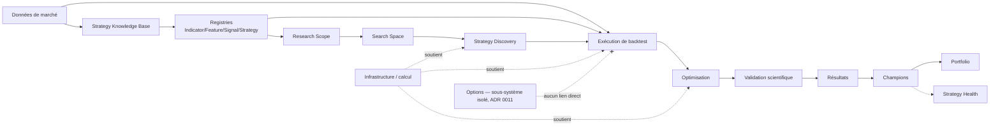
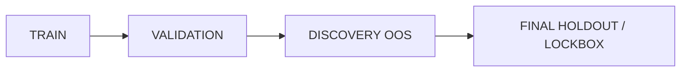

# Modèle de domaine cible

> Capacités utilisées pour ce document : **`domain-modeling`**, **`codebase-design`** (vérification
> de forme des Registries/ExecutionModel), **`grill-with-docs`** (durcissement du plan avant
> écriture — voir note de transparence dans le compte rendu associé). Ce document complète —
> sans le dupliquer — `CONTEXT.md`, qui reste la source de vérité du vocabulaire **déjà confirmé
> dans le code**. Il a été révisé le 2026-08-14 (mission `AF-DOM-01`) pour intégrer la cible
> **AlphaForge V2** — évolution du système existant, jamais un remplacement. Rien de ce qui suit
> n'est codé ; rien n'est `Accepted` tant qu'aucun ADR ne le dit explicitement.

## Légende

| Statut | Signification |
|---|---|
| **EXISTING / IMPLEMENTED** | Constaté dans le code aujourd'hui (équivalent de l'ancien "Fait vérifié") |
| **PARTIAL** | Existe mais incomplet — le code produit la structure sans la remplir entièrement |
| **PROPOSED** | Concept cible AlphaForge V2, non implémenté, mais une intention de conception concrète issue de cette mission |
| **OPEN QUESTION** | Genuinely undecided — nécessite une validation explicite avec l'utilisateur avant d'être traité comme une décision |
| **FUTURE** | Reconnu comme nécessaire un jour, délibérément hors du périmètre de conception proche |

Une entrée `PROPOSED` ne devient jamais `Accepted` par la simple présence d'une section
"Décision" dans ce document — seul un ADR au statut `Accepted` fait foi (voir §19, mapping ADR).

---

## 1. Sous-domaines

Séparation stricte inchangée : **Options** ne partage que l'infrastructure générique (ADR 0011),
jamais les concepts métier des autres sous-domaines. Nouveauté par rapport à la version
précédente de ce document : **Strategy Knowledge Base**, **Registries**, **Research Scope**,
**Search Space**, **Strategy Discovery** et **Strategy Health** s'insèrent *en amont* de
l'exécution — ils ne remplacent aucun sous-domaine existant, ils en ajoutent de nouveaux avant.

---

## 2. Concepts — données de marché et reproductibilité

*(Section largement préservée de la version précédente — statuts inchangés sauf mention
contraire.)*

| Concept | Statut | Responsabilité | Identifiant | Cycle de vie |
|---|---|---|---|---|
| **DataProvider** | PROPOSED (aujourd'hui implicite : EODHD/IG/CSV local) | Représente un fournisseur | Nom du fournisseur | Statique, configuré |
| **ProviderInstrument / BrokerInstrument** | PROPOSED | Identifiant d'un instrument tel que connu par un fournisseur précis (ticker EODHD, EPIC IG) | (provider, symbole natif) | Découvert, mis en cache |
| **Instrument** | EXISTING / IMPLEMENTED (implicite, "Actif" dans `CONTEXT.md`) | Instrument canonique indépendant du fournisseur | Symbole canonique | Créé à l'import, jamais supprimé |
| **Market / Exchange** | PROPOSED | Marché/bourse de cotation, calendrier associé | Code marché | Statique |
| **MarketCalendar** | PARTIAL (`eodhd/calendar.py` existe, non branché à `resample.py` — ADR 0013) | Jours de bourse, sessions, jours fériés | Code marché | Mis à jour périodiquement |
| **TradingSession** | OPEN QUESTION (`CONTEXT.md` : "à confirmer") | Plage horaire de cotation active | (marché, session) | Statique par marché |

### Dataset vs DatasetVersion / Snapshot — clarification demandée

Confusion à lever explicitement : **`Dataset`** et **`DatasetVersion`/`DatasetSnapshot`** ne sont
**pas synonymes**.

- **`Dataset`** (EXISTING / IMPLEMENTED, implicite) — l'identité *logique* et durable d'un
  ensemble de bougies pour `(instrument, timeframe)`. Un `Dataset` peut évoluer dans le temps
  (nouvelles bougies ajoutées) — il n'est **jamais immuable** lui-même.
- **`DatasetVersion` / `DatasetSnapshot`** (PARTIAL — `SnapshotManifest` existant côté EODHD
  uniquement, jamais généralisé au CSV local) — une **version figée et immuable** d'un `Dataset`
  à un instant précis, identifiée par un `content_hash` réel. C'est **cet objet-là**, jamais le
  `Dataset` lui-même, qu'une expérience doit référencer pour être reproductible.

**État réel aujourd'hui (ne pas présumer que c'est déjà résolu)** : les manifestes produits en
production ont leurs champs `content_hash`/`snapshot_id`/`period_start`/`period_end` **vides**
dans la quasi-totalité des cas (confirmé par `CURRENT_STATE.md` §4) — le concept `DatasetVersion`
existe partiellement au niveau du code EODHD (`storage.SnapshotManifest`) mais n'est jamais relié
au manifeste de backtest réellement écrit (`BacktestManifest`, ADR 0008). **Aucune expérience
Discovery/Validation ne doit être considérée reproductible tant que ce branchement n'est pas
fait** — voir invariants §18.

Un `DatasetVersion` PROPOSED doit porter au minimum : `content_hash`, identifiant de
snapshot/version, période couverte (`period_start`/`period_end`), timeframe, timezone (toujours
UTC en interne, déjà le cas), session/calendrier associé si branché, provenance (fournisseur,
date de synchro). **Aucune de ces informations n'est garantie remplie aujourd'hui** — le statut
`PARTIAL` reflète cela, pas une promesse.

**Formulation prospective, pas rétroactive** (précision demandée en revue) : "`content_hash`
réel obligatoire" est un **invariant prospectif** pour les nouveaux pipelines de Validation
scientifique/Discovery (voir invariant §18, catégorie "PROPOSED TARGET"), **jamais** une
propriété prétendument déjà vraie des jobs historiques. **Un ancien job dont
`data_manifest.json` n'a pas de `content_hash` réel reste pleinement lisible et valide comme
résultat historique** (invariant §18, catégorie "LEGACY COMPATIBILITY") — il n'est simplement pas
éligible, en l'état, au niveau de preuve exigé par un futur `ResearchRun` scientifique. Aucun
ancien résultat n'est invalidé rétroactivement par ce document.

| Concept | Statut | Responsabilité | Identifiant | Cycle de vie |
|---|---|---|---|---|
| **DataQualityReport** | PARTIAL (`quality.analyze_quality`, volet calendrier non branché) | Résultat de contrôle qualité d'un `DatasetVersion` | (dataset version, date de contrôle) | Généré à chaque contrôle |
| **CorporateAction** | PROPOSED (parent de Dividend/StockSplit) | Événement affectant un instrument | (instrument, date, type) | Immuable une fois publié |
| **Dividend** | PARTIAL (connecteur EODHD écrit, zéro appelant en production) | Distribution de dividende | (instrument, date ex-dividende) | Immuable |
| **StockSplit** | PARTIAL (connecteur EODHD écrit, zéro appelant en production) | Division/regroupement d'actions — **nommé ainsi**, jamais "Split", pour éviter la collision avec *split train/test* déjà utilisé dans `CONTEXT.md` | (instrument, date, ratio) | Immuable |
| **DelistedInstrument** | PROPOSED | Marque un instrument radié, sans le supprimer du catalogue | Instrument + date de radiation | Terminal |

---

## 3. Strategy Knowledge Base (PROPOSED — nouveau sous-domaine)

*(Issu de l'invocation `domain-modeling` dédiée du second pass de convergence, 2026-08-14 —
repris et intégré ici.)*

### Décision de conception proposée : source déclarative Git + index opérationnel

**PROPOSED, non `Accepted`** (ADR à créer plus tard, pas dans cette mission) : séparer la
**connaissance déclarative versionnée** (fichiers Git) de **l'index opérationnel mutable**
(PostgreSQL — [ADR 0007](../adr/0007-postgresql-for-metadata.md), **statut `Proposed`, pas
`Accepted`** — ne jamais présenter cette direction comme actée). Ce pattern reprend celui déjà
utilisé pour les données de marché (brut immuable + hash + index PostgreSQL,
[ADR 0008](../adr/0008-market-data-storage-strategy.md), également `Proposed`) — pas un nouveau
pattern inventé pour l'occasion.

**Justification** (pourquoi ne pas simplement tout mettre en base) : un `ResearchRun` doit rester
reproductible des années plus tard via son `git_sha`. Si la connaissance déclarative (ce qu'est
un `Indicator`, un `StrategyTemplate`...) ne vivait qu'en base mutable, le `git_sha` seul ne
suffirait plus à reconstituer l'état exact du catalogue au moment de l'expérience.

| Concept | Statut | Nature | Où ça vivrait | Responsabilité |
|---|---|---|---|---|
| **KnowledgeSource** | PROPOSED | Déclaratif, immuable | Fichier Git | Origine externe (paper, livre, doc broker, observation) |
| **Reference** | PROPOSED | Déclaratif, immuable | Fichier Git | Citation précise à l'intérieur d'une `KnowledgeSource` (plusieurs `Reference` peuvent pointer vers la même `KnowledgeSource`) |
| **CatalogEntry** | PROPOSED | Opérationnel, **mutable** | Ligne PostgreSQL (ADR 0007, Proposed) | Pointeur `(chemin, content_hash)` vers un élément déclaratif + `ImplementationStatus` + `ValidationStatus` + historique de supersession |

### Deux axes de statut distincts — pas un seul champ ambigu

Correction explicite demandée par l'utilisateur : **`ImplementationStatus`** (le code
existe-t-il ?) et **`ValidationStatus`** (a-t-il été prouvé robuste ?) sont **deux axes
indépendants**, jamais un seul champ `status`. Encode directement le principe déjà énoncé par
l'utilisateur : **CATALOGUÉ ≠ IMPLÉMENTÉ ≠ TESTÉ ≠ VALIDÉ.**

| Axe | Valeurs proposées | Statut |
|---|---|---|
| `ImplementationStatus` | `NEW → VERIFIED_SOURCE → IMPLEMENTABLE → IMPLEMENTED → DEPRECATED → REJECTED` | PROPOSED |
| `ValidationStatus` | `EXPERIMENTAL → TESTED → VALIDATED` (aligné sur le futur pipeline de validation, §12) | PROPOSED |

Une `CatalogEntry` peut être `IMPLEMENTED` (le code/la définition existe et s'exécute) tout en
restant `EXPERIMENTAL` sur l'axe validation — c'est l'état attendu de `perfect_revolution_v1`
lui-même si on le faisait entrer dans ce système aujourd'hui : implémenté depuis longtemps,
jamais passé par walk-forward/Monte-Carlo (§12), donc `ValidationStatus = EXPERIMENTAL`, pas
`VALIDATED`.

**Provenance et historique** : une `CatalogEntry` n'est jamais supprimée, seulement **supersédée**
(`supersedes` / `superseded_by`) — un `ResearchRun` historique référence le `content_hash` exact
utilisé au moment de l'expérience, qui reste adressable indéfiniment même après supersession de
l'entrée "courante" (voir invariants §18).

---

## 4. Registries — Indicator / Feature / Signal / Strategy (PROPOSED)

Quatre registres **distincts** (pas un registre unique) — vérifié avec `codebase-design` : ce
sont quatre natures de domaine réellement différentes (entrées/sorties, inputs requis,
compatibilités différentes), pas une sur-segmentation artificielle. Chaque entrée de registre
décrit le **WHAT**, jamais le **HOW** (aucune implémentation Python n'est décidée ici) :

**Précision de revue — Registry ≠ ce qu'il contient** : un "Registry" (Indicator/Feature/Signal/
Strategy) est une **capacité/catalogue** (résolution, vérification de compatibilité,
versioning), pas une grosse entité métier persistée en elle-même. Les objets réellement
persistés et versionnés sont `IndicatorVersion`, `FeatureVersion`, `Signal`/`Condition`,
`StrategyTemplateVersion` — le "Registry" est le service qui les expose et les résout, pas un
enregistrement de plus à côté d'eux.

| Champ minimal | Description |
|---|---|
| `stable_id` | Identifiant stable, indépendant du nom d'affichage |
| `version` | Version de cette définition précise |
| `category` | Famille (ex. "moving average", "momentum", "volatility") |
| `typed_parameters` | Paramètres typés (nom, type, bornes) |
| `required_inputs` | Ce dont l'élément a besoin en entrée (OHLCV, volume, bid/ask...) |
| `outputs` | Ce que l'élément produit |
| `compatible_markets` / `compatible_timeframes` | Compatibilités déclarées |
| `warmup` | Nombre de barres nécessaires avant une valeur valide |
| `provenance` / `references` | Lien vers `KnowledgeSource`/`Reference` (§3) |
| `implementation_status` / `tests_status` | Reprend les axes du §3 |

| Registre | Statut | Ce qu'il catalogue | Dépend de |
|---|---|---|---|
| **Indicator Registry** | PROPOSED | `Indicator` / `IndicatorVersion` (EMA, RSI, ATR...) | Rien (peut démarrer dès que ce document existe) |
| **Feature Registry** | PROPOSED | `Feature` / `FeatureVersion` / `FeatureExpression` (transformations, z-scores...) | Conceptuellement construit sur des `Indicator` |
| **Signal Registry** | PROPOSED | `Signal` / `Condition` (crossover, seuil, persistance...) | Conceptuellement construit sur des `Feature` |
| **Strategy Registry** | PROPOSED, **additif** | `StrategyTemplate` / `StrategyTemplateVersion` | Voir §5 — ne remplace jamais la découverte Python existante |

---

## 5. Strategy Representation — StrategyTemplate, ParameterSet, StrategyDefinition

### Ce qui ne change pas

**EXISTING / IMPLEMENTED, inchangé** : la découverte dynamique Python actuelle
(`glob.glob("strategies/*.py")`, contrat `reset/prepare/on_bar` duck-typé) continue de
fonctionner sans aucune adaptation. `perfect_revolution_v1.py` reste **l'étalon de
non-régression**, jamais modifié pour cette mission.

| Concept existant | Statut |
|---|---|
| **Strategy** | EXISTING / IMPLEMENTED (`strategies/*.py`, contrat `reset/prepare/on_bar`) |
| **StrategyVersion** | **OPEN QUESTION, inchangée** — `CONTEXT.md` note déjà "pas de versioning formel" ; cette mission ne tranche pas ce point, elle ajoute des concepts adjacents sans le résoudre |
| **StrategyParameter** | EXISTING / IMPLEMENTED (`DEFAULT_PARAMS`/`PARAM_SCHEMA`) |

### StrategyTemplate — couche additive (PROPOSED)

`StrategyTemplate` est une métadonnée déclarative **dérivée par introspection** d'un fichier
`strategies/*.py` existant — pas un nouveau fichier, pas de duplication de code. Pour
`perfect_revolution_v1.py`, `STRATEGY_NAME`/`DEFAULT_PARAMS`/`PARAM_SCHEMA` **existent déjà** et
suffisent à produire son premier `StrategyTemplate` sans toucher au fichier.

Test de suppression (principe `codebase-design`) : si l'on supprime tout le Registry, le fichier
`perfect_revolution_v1.py` s'exécute toujours à l'identique via le chemin de découverte actuel —
**la couche est structurellement additive, pas seulement par promesse**.

### StrategyDefinition — le nom retenu pour la représentation générée/déclarative

**Décision de nommage (avec justification, comme demandé — pas choisi par sonorité)** :

| Nom candidat | Rejeté ? | Raison |
|---|---|---|
| `StrategyGenome` | Rejeté | Présuppose une origine évolutionnaire — inadapté à une stratégie issue d'une recherche exhaustive, aléatoire ou bayésienne |
| `StrategyRecipe` | Rejeté | Registre trop familier pour une entité versionnée avec hash canonique |
| `StrategyExpression` | Rejeté | **Collision de glossaire** directe avec `FeatureExpression` (§4) déjà scopé à la composition *au niveau d'une seule feature* — réutiliser "Expression" au niveau stratégie entière créerait une ambiguïté immédiate |
| `StrategySpecification` | Rejeté | **Collision** avec le vocabulaire "spec" déjà établi dans ce dépôt pour Spec Kit (`docs/adr/0016-...`, `to-spec`) — un terme totalement différent (gouvernance WHAT) qui n'a rien à voir avec une structure runtime-compilable |
| **`StrategyDefinition`** | **Retenu** | Registre formel adapté, aucune collision avec un terme déjà établi dans ce dépôt, s'accorde naturellement avec `BacktestConfiguration`/`ParameterSet` déjà existants, ne présuppose aucune méthode de génération |

**Simplification issue du processus `domain-modeling`** (pas seulement une addition — une
clarification structurelle) : `StrategyDefinition` devient le concept **unificateur** — la
composition complète, canonique et hashable de la logique d'une stratégie (features + conditions
+ signaux + règles d'entrée/sortie + gestion du risque + position sizing + relations
multi-timeframe si applicable), **quelle que soit son origine** :

- **Origine "template"** : `StrategyTemplateVersion` + `ParameterSet` **se résolvent en** une
  `StrategyDefinition` (cas de `perfect_revolution_v1` — la résolution est aujourd'hui triviale :
  "exécuter ce fichier avec ces paramètres").
- **Origine "générée"** : le futur Combination Engine assemble directement une
  `StrategyDefinition` à partir du catalogue (Indicator/Feature/Signal Registry), sans passer par
  aucun `StrategyTemplate` — exemple donné par l'utilisateur (EMA slope H1 AND RSI M15 AND volume
  percentile AND breakout M5 → entrée, stop ATR, sortie trailing).

Un `CandidateStrategy` (§9) référence donc **toujours** une `StrategyDefinition` (par hash), et
porte séparément sa **provenance** (comment cette définition a été produite) — ce qui simplifie
le modèle par rapport à un `CandidateStrategy` à deux formes structurellement différentes.

### Identité vs version vs hash — distinction explicite (correction de revue)

Ne pas confondre trois choses différentes :

- **`StrategyDefinition.canonical_hash`** — identité **par contenu** (content-addressed, comme un
  objet Git) : calculé **uniquement sur la composition sémantique** (features, conditions,
  signaux, règles, paramètres qui affectent le comportement). **Exclut explicitement** le format
  de sérialisation et toute métadonnée non sémantique (date de création, commentaire, auteur).
  Une `StrategyDefinition` est donc **content-addressed** — elle n'a pas besoin d'un identifiant
  mutable séparé : deux compositions sémantiquement identiques partagent le même
  `canonical_hash`, quelle que soit leur origine.
- **`StrategyTemplate.template_id`** — identité **stable dans le temps**, portée par le
  `StrategyTemplate` (pas par `StrategyDefinition`) : `perfect_revolution` reste le même
  `template_id` même si une future `StrategyTemplateVersion` change la forme des règles.
  `StrategyTemplateVersion` capture ces évolutions structurelles du template lui-même.
- **`ParameterSet`** — n'a pas d'identité propre à long terme ; il participe à la résolution
  `(StrategyTemplateVersion, ParameterSet) → StrategyDefinition.canonical_hash`.

**Réponse à la question de test** (si on change uniquement la sérialisation ou une métadonnée non
sémantique, est-ce une nouvelle stratégie ?) : **non** — le `canonical_hash` ne change pas, donc
ce n'est **pas** une nouvelle `StrategyDefinition`. Ce n'est une nouvelle définition que si la
composition sémantique change réellement (nouveau paramètre, nouvelle règle, nouveau seuil).

**Lien avec l'éditeur de stratégies (préservé de la version précédente, [ADR 0014](../adr/0014-strategy-authoring-python-vs-dsl.md), `Decision pending`)** : si un DSL est retenu, ses concepts
candidats (règle condition ET/OU, indicateur référencé, fenêtre horaire, stop, objectif, trailing
stop, filtre de marché) seraient précisément ce qui **compile vers** une `StrategyDefinition` —
`StrategyDefinition` devient ainsi la cible de compilation commune, pour ne jamais dupliquer le
chemin d'exécution entre stratégies Python et stratégies DSL. ADR 0014 reste `Decision pending`,
non tranché par ce document.

---

## 6. Research Scope vs Search Space (PROPOSED)

Distinction stricte, jamais confondue :

| Concept | Nature | Statut |
|---|---|---|
| **ResearchScope** | **Intention / configuration utilisateur** — ce que l'utilisateur autorise à rechercher | PROPOSED |
| **SearchSpace** | **Espace de candidats réellement dérivé** — résultat du calcul `ResearchScope × version du catalogue à un instant donné` | PROPOSED |

`ResearchScope` doit être **versionnable, persistable, validable (détection de combinaisons
incompatibles), reproductible**. Champs a minima : marchés/instruments, timeframes, styles de
trading, familles de stratégies, `StrategyTemplate`(s) ciblé(s), indicateurs/features autorisés
(inclusions/exclusions), direction, sessions, plage de dates, modèle d'exécution visé, méthode de
recherche, budget de calcul, plan de validation prévu.

Distinction explicite **AVAILABLE UNIVERSE** (tout ce que le système sait cataloguer, potentiellement
énorme) vs **SELECTED RESEARCH SCOPE** (le sous-ensemble précis qu'une expérience donnée
explore) — un `ResearchScope` ne référence jamais l'univers entier implicitement, toujours un
sous-ensemble explicite (même si ce sous-ensemble est "tout ce qui est compatible avec X").

`SearchSpace` conserve/calcule : éléments disponibles, éléments compatibles, contraintes, nombre
théorique de candidats, nombre de paires/triplets possibles, limites de combinaison d'ordre
supérieur, version/hash du `SearchSpace` lui-même (dépend à la fois du `ResearchScope` et de
l'état exact du catalogue au moment du calcul — deux calculs à des dates différentes peuvent
donner des `SearchSpace` différents même pour un `ResearchScope` identique, si le catalogue a
changé entre-temps).

**Précision de revue — `SearchSpace` n'est pas un champ de `Experiment`** : puisqu'il dépend de
l'état du catalogue *au moment du calcul*, un `SearchSpace` est calculé/référencé **par chaque
`ResearchRun` à son lancement**, jamais stocké une fois pour toutes sur l'`Experiment` parent. Un
même `Experiment` (même `ResearchScope` de base) peut ainsi voir ses `ResearchRun` successifs
référencer des `SearchSpace` différents si le catalogue a évolué entre deux lancements — c'est
attendu, pas une incohérence.

**Précision de revue — double sens de `timeframes` selon le contexte (trouvé par le scénario
mental D, §16)** : dans un `ResearchScope`, le champ `timeframes` a une sémantique différente
selon l'usage qui en est fait par la `SearchMethod` — (A) *"tester séparément sur chacun de ces
timeframes"* (produit plusieurs `CandidateStrategy` mono-timeframe distincts) vs (B) *"ensemble de
timeframes éligibles pour composer une `StrategyDefinition` intrinsèquement multi-timeframe"*
(produit un seul `CandidateStrategy` combinant plusieurs timeframes en interne, voir §16). Le
champ reste unique dans `ResearchScope`, mais son interprétation dépend du mode de génération
demandé — à documenter explicitement lors de l'implémentation, pas résolu plus finement ici.

---

## 7. Experiment, ResearchRun et les exécutions concrètes (PROPOSED)

### La distinction Experiment / ResearchRun est réelle, pas une sur-modélisation

Vérifiée par un scénario concret (méthode `domain-modeling` — "discuter des scénarios
concrets") : le principe **Random Baseline obligatoire** (déjà exigé par l'utilisateur) impose de
pouvoir comparer *plusieurs méthodes de recherche sur la même question de recherche* dans le
temps (ex. Random Baseline aujourd'hui, algorithme génétique demain, Bayésien la semaine
suivante — tous pour "NASDAQ Day Trading M15"). Sans un conteneur durable, ce regroupement
resterait un rapprochement ad hoc de hashes de scope, pas une intention explicite.

| Concept | Statut | Nature | Portée |
|---|---|---|---|
| **Experiment** | PROPOSED | Conteneur **durable** — une ligne de recherche nommée (`hypothesis`/question de recherche en texte libre optionnel), liée à un `ResearchScope` (pouvant évoluer légèrement entre runs, ex. budget élargi) | Peut regrouper plusieurs `ResearchRun` |
| **ResearchRun** | PROPOSED | Exécution **concrète, immuable, reproductible** d'une `SearchMethod` sur un `SearchSpace` dérivé d'une version figée du `ResearchScope`, à un instant donné | Une seule exécution |

### Concepts existants préservés (inchangés depuis la version précédente de ce document)

| Concept | Statut | Responsabilité |
|---|---|---|
| **Trade** | EXISTING / IMPLEMENTED (`trades.csv`, implicite dans `engine.py`) | Aller-retour entrée/sortie complet |
| **Result** | EXISTING / IMPLEMENTED (`results.csv`) | Résultat d'une combinaison testée |
| **Metric** | EXISTING / IMPLEMENTED (`metrics.json`, `scoring.py`) | Mesure de performance calculée |
| **Artifact** | EXISTING / IMPLEMENTED (fichiers du job directory) | Tout fichier produit par un job |
| **Manifest** | PARTIAL (`BacktestManifest` existe, champs `content_hash`/`snapshot_id`/`period_start`/`period_end` vides dans la quasi-totalité des manifestes produits — voir §2, ADR 0008) | Provenance des données utilisées par un job |

### Frontières avec les exécutions existantes et proposées — éviter les synonymes inutiles

| Concept | Statut | Invariant propre | Relation à ResearchRun |
|---|---|---|---|
| **BacktestJob / OptimizationJob** | EXISTING / IMPLEMENTED, **inchangés** | "Un backtest/une campagne d'optimisation s'est exécuté(e), a produit trades/equity/stats" | Un `ResearchRun` en mode Discovery peut déclencher **de nombreux** `BacktestJob`/`OptimizationJob` internes (un par `CandidateStrategy` évalué) — ce ne sont pas des synonymes, ce sont des unités d'exécution réutilisées *à l'intérieur* d'un `ResearchRun` |
| **ValidationRun** | PROPOSED | "Une méthode de validation précise a été appliquée à un candidat/Champion et a produit un verdict/intervalle de confiance" — invariant **différent** d'un backtest simple | Rattaché à un `CandidateStrategy` ou `Champion`, pas nécessairement à un `ResearchRun` (une validation peut être relancée indépendamment) |
| **RobustnessTest** | **Terme à ne PAS garder comme entité séparée** — clarification `domain-modeling` : traité comme un **type** de `ValidationRun` (`validation_type = walk_forward \| monte_carlo \| parameter_stability \| stress_test \| ...`), pas une entité distincte, pour éviter la prolifération de synonymes explicitement mise en garde par l'utilisateur | — | — |

---

## 8. SearchMethod (PROPOSED)

Abstraction commune, aucune implémentation choisie dans cette mission : `Exhaustive`, `Random`,
`Evolutionary`, `Genetic`, `Bayesian`, `CMA-ES`, éventuellement `GeneticProgramming` si
scientifiquement justifié plus tard. Un `ResearchRun` référence exactement une `SearchMethod`
utilisée. **Random Baseline n'est pas une méthode à part mais une instance de `SearchMethod =
Random`** systématiquement associée (règle produit, pas une contrainte de domaine) à toute
campagne utilisant une méthode plus sophistiquée — la comparaison se fait au niveau `Experiment`
(§7), en rapprochant deux `ResearchRun` partageant le même `ResearchScope`.

---

## 9. CandidateStrategy (PROPOSED)

Grâce à l'unification autour de `StrategyDefinition` (§5), `CandidateStrategy` reste un concept
unique et simple :

| Champ | Description |
|---|---|
| `strategy_definition_hash` | Référence canonique vers la `StrategyDefinition` évaluée |
| `provenance` | `from_template` (avec `StrategyTemplateVersion` + `ParameterSet`) **ou** `generated` (avec `SearchMethod` + `ResearchRun`) |
| `lineage` | Parent(s)/génération — **uniquement rempli si pertinent** (ex. algorithme génétique) ; **jamais obligatoire** pour un Random Search simple, conformément à la consigne explicite de ne pas imposer de vocabulaire génétique partout |
| `canonical_hash` | Permet la déduplication de candidats logiquement identiques |
| `metrics` | Résultats de backtest |
| `validation_status` | Reprend l'axe du §3 |

---

## 10. ExecutionModel — domaine du futur Precision Engine (PROPOSED, réflexion amorcée)

### `engine.py` reste le Reference Engine — jamais renommé "Precision Engine"

**EXISTING / IMPLEMENTED, inchangé et non contredit** : `engine.py` est le
**CURRENT REFERENCE ENGINE** — déterministe bar-by-bar, validé identique Windows/OCI. Il ne
devient "Precision Engine" qu'une fois un contrat cible défini **et** testé en conformance (voir
`LINUX_PORTABILITY_REPORT.md`/second pass de convergence pour le chemin de migration complet —
non répété ici, ce document décrit uniquement le domaine nécessaire).

### Un seul concept ExecutionModel, pas quatre entités séparées

Vérifié avec `codebase-design` (principe "un seul adapter = seam hypothétique, deux adapters =
seam réel") : aujourd'hui **un seul** modèle d'exécution existe réellement (spread/slippage plats
dans `engine.py`) ; un second (Precision) est **articulé concrètement** (`TEST_AND_VALIDATION_
ARCHITECTURE.md` §3 liste précisément ce qui manque) mais pas encore construit. Conclusion : le
domaine modélise **un concept composite unique `ExecutionModel`** (satisfait aujourd'hui par un
adapter "Simple", demain aussi par un adapter "Precision") — **pas** quatre entités
`CommissionModel`/`SlippageModel`/`SpreadModel`/`MarginModel` indépendantes au niveau du domaine.
Rien aujourd'hui ne varie ces quatre aspects indépendamment les uns des autres ; les séparer
maintenant serait de la sur-modélisation.

| Concept | Statut | Nécessaire pour |
|---|---|---|
| **ExecutionModel** | PROPOSED (concept composite unique) | Référencé par `CandidateStrategy`/`ResearchRun`/`Champion` — quelles hypothèses d'exécution ont produit ce résultat. **Composition interne (précision de revue)** : un `ExecutionModel` est structuré en politiques nommées et individuellement versionnables (`commission_policy`, `slippage_policy`, `spread_policy`, `margin_policy`) — pas des paramètres plats non typés. Ces politiques restent des **attributs internes d'un seul `ExecutionModel`**, pas des entités de premier niveau séparées (voir justification "un seul adapter" ci-dessus) ; le jour où un second modèle réel exige de faire varier l'une d'elles indépendamment des autres, cette politique pourra être promue en concept séparé — pas avant. |
| **Order / OrderType** | PROPOSED | Futur Precision Engine uniquement — absent du Reference Engine actuel |
| **Position** | EXISTING / IMPLEMENTED (état interne du moteur actuel, jamais exposé comme objet de domaine séparé) | — |
| **Trade** | EXISTING / IMPLEMENTED (`trades.csv`) | — |
| **Fill / Execution** | PROPOSED, **uniquement si le Precision Engine le justifie** — pas construit tant que la simple exécution au prix d'ouverture suivant (comportement actuel, `CURRENT_STATE.md`) suffit | Futur Precision Engine |

Ce domaine sert de fondation à un futur `PRECISION ENGINE CONTRACT` — la réflexion peut commencer
maintenant, l'implémentation attend que ces concepts soient stabilisés (repris tel quel du second
pass de convergence, non re-décidé ici).

---

## 11. Validation scientifique (PROPOSED, architecture déjà préparée ailleurs)

*(Section préservée — voir `TEST_AND_VALIDATION_ARCHITECTURE.md` pour le détail complet, ce
document ne fait qu'aligner le vocabulaire de domaine.)*

| Concept | Statut | Relation |
|---|---|---|
| **ValidationCampaign** | PROPOSED | Regroupe les `ValidationRun` (walk-forward, Monte-Carlo, etc.) pour un `CandidateStrategy` donné |
| **ValidationRun** | PROPOSED (voir §7) | Une exécution précise d'un type de validation |
| **ParameterStability** | PROPOSED | Type de `ValidationRun` — vérifie qu'un résultat n'est pas un pic isolé |
| **StressTest** | PROPOSED | Type de `ValidationRun` — perturbation spread/slippage/délai/gaps |

**Précision de revue — pas un dict opaque générique** : `walk_forward`, `monte_carlo`,
`parameter_stability` et `stress_test` ont des invariants, configurations et preuves
**réellement différents** (une fenêtre glissante n'a rien à voir avec une distribution de
simulations). Chaque `ValidationRun` porte donc une **`ValidationSpecification` et une
`ValidationEvidence` typées selon son `validation_type`** — pas un simple couple
`config: dict, result: dict` sans structure métier. La forme exacte de chaque paire
(`WalkForwardSpecification`/`WalkForwardEvidence`, `MonteCarloSpecification`/`MonteCarloEvidence`,
etc.) n'est **pas détaillée dans cette mission** — seule l'exigence de typage par `validation_type`
est actée ici, pas les champs précis de chaque variante.

---

## 12. Dataset splits et Final Holdout / Lockbox (PROPOSED — anti-leakage)

Problème explicitement nommé : **Search History Leakage**. Un `FINAL HOLDOUT` non consulté dans
le `ResearchRun` courant ne suffit pas — s'il a été consulté lors d'une expérience *précédente*,
des décisions humaines prises entre-temps peuvent avoir été influencées, contaminant
progressivement le dataset sans que rien ne le détecte.

**Concept proposé (modélisation minimale, pas un système de sécurité complet — comme demandé)** :

| Concept | Statut | Champs proposés |
|---|---|---|
| **DatasetSplitPlan** | PROPOSED | Définit les frontières `TRAIN`/`VALIDATION`/`DISCOVERY OOS`/`FINAL HOLDOUT` pour un `DatasetVersion` donné (référence directe au `dataset_version_id` et à la période couverte) |
| **HoldoutAccessEvent** | PROPOSED | `dataset_version_id` (référencé directement, pas seulement via `DatasetSplitPlan`, pour un audit sans jointure implicite), `locked_state`, `first_opened_at`, **`research_run_id`** ayant consulté (l'`experiment_id` s'en déduit), `reason` — rend la consultation **observable et auditable**, sans empêcher techniquement l'accès (pas un contrôle d'accès, un journal) |

But explicite : rendre visible *que* le holdout a été ouvert et *par quelle exécution précise*,
pas construire un mécanisme d'application technique — cohérent avec la demande de ne pas
sur-construire ce point dans le modèle de domaine.

**Invariant renforcé (correction de revue)** : un `FINAL HOLDOUT` possédant au moins un
`HoldoutAccessEvent` **ne peut plus être décrit comme "untouched"** dans aucun rapport, `Champion`
ou export futur — toute affirmation de fraîcheur d'un holdout doit consulter les
`HoldoutAccessEvent` réels, jamais le présumer par défaut (voir invariant §18).

---

## 13. Champions (statut existant préservé, lifecycle proposé séparément)

**EXISTING / IMPLEMENTED, non redéfini** : le vocabulaire `champion_*.py` existe fortement dans
le code. **OPEN QUESTION, inchangée** (déjà notée §5 de la version précédente de ce document) :
les frontières précises de "Champion" ne sont toujours pas validées avec l'utilisateur — cette
mission ne les tranche pas.

**Lifecycle proposé (PROPOSED, explicitement non décidé)** :

Un futur `Champion` référencerait : `StrategyDefinition`/version, `ParameterSet`, `DatasetVersion`,
preuves de validation (`ValidationRun`(s)), **`ValidationPolicyVersion`** (précision de revue —
concept léger : identifie *quelle version des règles de promotion* a été appliquée, pour lever
l'ambiguïté temporelle si ces règles évoluent ; référencé, pas une nouvelle machinerie), `ExecutionModel`, `git_sha`, date. **Aucun Champion existant
n'est rétroactivement reclassé** par ce document — un Champion promu avant l'existence d'une
`ValidationPolicyVersion` reste interprétable selon les règles historiques informelles qui
s'appliquaient à l'époque, jamais réévalué silencieusement contre une politique plus récente.

---

## 13bis. Multi-actifs (PROPOSED — Phase 5, préservé de la version précédente)

Extensions nécessaires à `Instrument` par classe d'actif, sans dupliquer le moteur :

| Attribut | Actions/Indices | Forex | Matières premières | Futures | Options |
|---|---|---|---|---|---|
| Devise de cotation | Oui | Oui (paire) | Oui | Oui | Oui |
| Taille de contrat | Non pertinent | Lot standard | Contrat | Contrat | Contrat |
| Valeur du point | Oui | Oui | Oui | Oui | Dépend du sous-jacent |
| Tick size | Oui | Oui | Oui | Oui | Oui |
| Calendrier/horaires | Bourse | 24/5 | Bourse dérivés | Bourse dérivés | Bourse dérivés |
| Corporate actions | Oui | Non | Non | Non | Sur le sous-jacent |
| Échéance | Non | Non | Parfois (futures physiques) | Oui | Oui |

## 14. Portfolio (PROPOSED, extension de la mention minimale précédente)

| Concept | Statut |
|---|---|
| **Portfolio** | PROPOSED — regroupe plusieurs `Champion`/`StrategyDefinition` avec capital partagé |
| **Allocation** | PROPOSED |
| **Exposure** | PROPOSED |
| **PortfolioRun** | PROPOSED, **uniquement si nécessaire** — réutilise `Position`/`Trade` existants plutôt que de les dupliquer pour le seul besoin du portefeuille |

Multi-actifs (Phase 5 existante, `DOMAIN_MODEL.md` §6 de la version précédente) reste le
prérequis structurel — non répété ici.

---

## 15. Strategy Health (FUTURE)

**Distinction explicite demandée** : `StrategyHealth` **n'est pas** la performance historique du
backtest — c'est le suivi **dans le temps** d'une stratégie *déjà* validée : dérive par rapport à
sa baseline de validation, drawdown courant, sensibilité au régime de marché, signaux de
dégradation. Statut **FUTURE** : reconnu nécessaire, explicitement hors du périmètre de
conception proche (dépend de Champions opérationnels en premier).

---

## 16. Multi-timeframe — deux notions distinctes, jamais confondues

| Notion | Description | Où ça vit dans le modèle |
|---|---|---|
| **(A) Test multi-timeframe** | La **même** `StrategyDefinition` évaluée séparément sur plusieurs timeframes (ex. M5, M15, H1 chacun indépendamment) | Dimension du `ResearchScope` (§6) — plusieurs `CandidateStrategy` distincts, un par timeframe |
| **(B) Stratégie intrinsèquement multi-timeframe** | **Une seule** `StrategyDefinition` combinant plusieurs timeframes simultanément dans sa propre logique (ex. tendance H1 + signal M15 + entrée M5) | Propriété **interne** à la `StrategyDefinition` elle-même (§5) — jamais une dimension du `ResearchScope` |

Ces deux notions ne doivent **jamais** être confondues dans l'implémentation future : (A) change
le nombre de candidats explorés, (B) change la structure d'un candidat unique.

---

## 17. Options et produits dérivés (préservé, isolation ADR 0011 inchangée)

*(Section identique à la version précédente — aucun changement.)*

| Concept | Responsabilité |
|---|---|
| **OptionContract** | Un contrat précis (instrument, strike, expiry, call/put) |
| **OptionChain** | Ensemble des contrats disponibles pour un sous-jacent à un instant donné |
| **OptionStrategy** | Combinaison multi-jambes (spread, straddle, etc.) |

Distinction obligatoire déjà actée (ADR 0011) entre données (1) réellement historiques, (2)
capturées via IG à partir de maintenant, (3) théoriques reconstruites, (4) backtests sur
sous-jacent seul — jamais mélangées sans étiquette visible. **Ce bounded context ne partage aucun
concept métier avec les sections 3 à 16 ci-dessus.**

---

## 18. Invariants du domaine

**Classement en 3 catégories (correction de revue — ne jamais mélanger "vrai aujourd'hui" et "ce
qui devra devenir obligatoire")** :

### CURRENT INVARIANT (déjà vrai dans le code aujourd'hui)

| # | Invariant |
|---|---|
| 4 | Un résultat (`Result`/`metrics`) ne change jamais rétroactivement une fois écrit — déjà vrai pour `results.csv` |
| 6 | Un ancien job (`BacktestJob`/`OptimizationJob`) reste lisible tel quel — contrat de fichiers jamais cassé rétroactivement |

### LEGACY COMPATIBILITY RULE (contrainte de non-régression envers l'existant)

| # | Invariant |
|---|---|
| 6bis | Un ancien job dont `data_manifest.json` n'a pas de `content_hash` réel **reste pleinement lisible et valide** comme résultat historique — jamais invalidé rétroactivement (voir §2) |
| 6ter | Un Champion promu avant l'existence d'une `ValidationPolicyVersion` reste interprétable selon les règles historiques informelles, jamais réévalué silencieusement contre une politique plus récente (voir §13) |

### PROPOSED TARGET INVARIANT (aucun n'est `Accepted` — à valider explicitement, ADR futurs)

| # | Invariant |
|---|---|
| 1 | Un `DatasetVersion` est immuable une fois créé |
| 2 | Un `ResearchRun` référence un `ResearchScope` figé (jamais modifié après le lancement) |
| 3 | Un `SearchSpace` est dérivable de versions exactes du `ResearchScope` et du catalogue — jamais recalculé silencieusement avec un catalogue différent sans nouvelle version ; il n'est jamais stocké sur `Experiment`, toujours recalculé/référencé par chaque `ResearchRun` (voir §6) |
| 5 | Un `CandidateStrategy` peut être reproduit à partir de sa `StrategyDefinition` (identité par `canonical_hash`, voir §5) + versions référencées + seed, lorsque applicable |
| 7 | Un `FINAL HOLDOUT` possédant au moins un `HoldoutAccessEvent` **ne peut plus être décrit comme "untouched"** dans aucun rapport/Champion futur — toute affirmation de fraîcheur doit consulter les événements réels, jamais les présumer (renforcé en revue, voir §12) |
| 8 | Catalogué (`CatalogEntry`) n'implique jamais robuste (`ValidationStatus` distinct de `ImplementationStatus`) |
| 9 | Un `Champion` nécessite des preuves de validation (`ValidationRun`) suffisantes selon une `ValidationPolicyVersion` explicite — dépend du lifecycle §13 (OPEN QUESTION) |

Aucun invariant `PROPOSED TARGET` n'est une règle `Accepted` — ce sont des propositions issues de
cette mission. Les `LEGACY COMPATIBILITY RULE` sont, elles, des garde-fous de non-régression
immédiatement applicables dès qu'un concept AlphaForge touche une donnée historique.

---

## 19. Compatibilité avec l'existant — mapping migration

| Concept actuel | Concept AlphaForge | Migration |
|---|---|---|
| `strategies/perfect_revolution_v1.py` | `Strategy` (inchangé) + `StrategyTemplate` (nouveau, additif) | Introspection du fichier existant, zéro modification du fichier |
| `config_used.json` / `BacktestConfiguration` | Reste la source pour `BacktestJob`/`OptimizationJob` ; `ResearchScope` est une couche **au-dessus**, pas un remplacement | Additive — **un vieux `config_used.json` n'est PAS automatiquement un `ResearchScope` AlphaForge complet** (correction de revue) : il peut au mieux alimenter une représentation **minimale/partielle** (instrument, timeframe, plage de dates) ; exclusions, versions de catalogue, `SearchMethod`, plan de validation **n'existaient pas historiquement** et ne doivent jamais être présumés rétroactivement présents lors d'un mapping automatique |
| `BacktestJob` / `OptimizationJob` | Inchangés ; deviennent des unités d'exécution réutilisables *à l'intérieur* d'un `ResearchRun` en mode Discovery | Aucune migration destructive |
| `Result` / `Metric` / `Artifact` | Inchangés | Aucune migration |
| `BacktestManifest` | Reste la structure de fichier ; ses champs vides (`content_hash` etc.) doivent être réellement remplis avant toute Validation scientifique fiable (voir §2, ADR 0008) | Correction de bug déjà identifiée, pas un changement de format |
| `Champion` actuel (`champion_*.py`) | Concept préservé tel quel ; le lifecycle `CANDIDATE→PROMISING→VALIDATED→CHAMPION` (§13) est **additif et proposé**, aucun Champion existant reclassé | Aucune migration rétroactive |

**Perfect Revolution continue de fonctionner sans migration destructive** — condition validée par
construction dans chaque section ci-dessus (Strategy Registry additif, ExecutionModel composite
n'exige rien du moteur actuel, aucun invariant ne casse le contrat de fichiers existant).
