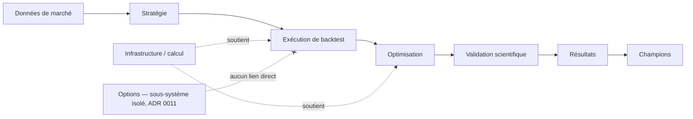

# Modèle de domaine cible

> Capacité utilisée pour ce document : **`domain-modeling`**. Ce document complète — sans le
> dupliquer — `CONTEXT.md`, qui reste la source de vérité du vocabulaire **déjà confirmé dans le
> code**. Les concepts ci-dessous sont pour la plupart **cibles** (Proposition/Hypothèse), pas
> encore implémentés : ils ne doivent migrer vers `CONTEXT.md` qu'une fois réellement construits
> et confirmés, conformément à la règle déjà en vigueur dans ce dépôt (`CONTEXT.md` distingue
> "Confirmé" de "À confirmer").

## Légende

**Fait vérifié** (existe déjà dans le code) — **Proposition** (concept cible de cette mission) —
**Hypothèse** (à valider) — **Question ouverte**.

## 1. Sous-domaines

Séparation stricte : le sous-domaine **Options** ne partage que l'infrastructure générique
(voir ADR 0011), jamais les concepts métier des autres sous-domaines.

## 2. Concepts — données de marché (partiellement existants)

| Concept | Statut | Responsabilité | Identifiant | Cycle de vie |
|---|---|---|---|---|
| **DataProvider** | Proposition (aujourd'hui implicite : EODHD/IG/CSV local, pas de type unifié) | Représente un fournisseur (EODHD, IG, CSV) | Nom du fournisseur | Statique, configuré |
| **ProviderInstrument** | Proposition | Identifiant d'un instrument tel que connu par un fournisseur précis (ticker EODHD, EPIC IG) | (provider, symbole natif) | Découvert, mis en cache |
| **Instrument** | Fait vérifié (implicite, "Actif" dans `CONTEXT.md`) | Instrument canonique indépendant du fournisseur | Symbole canonique | Créé à l'import, jamais supprimé |
| **Market / Exchange** | Proposition (absent comme concept explicite) | Marché/bourse de cotation, calendrier associé | Code marché | Statique |
| **MarketCalendar** | Fait vérifié partiel (`eodhd/calendar.py` existe, non branché — ADR 0013) | Jours de bourse, sessions, jours fériés | Code marché | Mis à jour périodiquement |
| **TradingSession** | Question ouverte (CONTEXT.md : "À confirmer") | Plage horaire de cotation active | (marché, session) | Statique par marché |
| **Dataset** | Fait vérifié (implicite : snapshot normalisé) | Ensemble de bougies pour (instrument, timeframe, période) | content_hash | Immuable une fois créé |
| **DatasetSnapshot** | Fait vérifié (`SnapshotManifest`, EODHD uniquement aujourd'hui) | Version figée et hashée d'un Dataset | content_hash | Immuable |
| **DataQualityReport** | Fait vérifié partiel (`quality.analyze_quality`, sans le volet calendrier branché) | Résultat de contrôle qualité d'un Dataset | (dataset, date de contrôle) | Généré à chaque contrôle |
| **CorporateAction** | Proposition (parent de Dividend/Split) | Événement affectant un instrument | (instrument, date, type) | Immuable une fois publié |
| **Dividend** | Fait vérifié au niveau connecteur (non branché) | Distribution de dividende | (instrument, date ex-dividende) | Immuable |
| **Split** | Fait vérifié au niveau connecteur (non branché) ; attention ambiguïté avec "split train/test" déjà utilisé dans `CONTEXT.md` — nommer **StockSplit** pour éviter la confusion | Division/regroupement d'actions | (instrument, date, ratio) | Immuable |
| **DelistedInstrument** | Proposition | Marque un instrument radié, sans le supprimer du catalogue | Instrument + date de radiation | Terminal |

## 3. Concepts — stratégie et exécution

| Concept | Statut | Responsabilité | Identifiant | Cycle de vie |
|---|---|---|---|---|
| **Strategy** | Fait vérifié (`strategies/*.py`, contrat `reset/prepare/on_bar`) | Logique de signal, déléguée par le moteur | `STRATEGY_NAME` | Fichier versionné dans Git |
| **StrategyVersion** | Question ouverte (`CONTEXT.md` : "pas de versioning formel") | Version identifiable d'une stratégie | (nom, version) | À définir (Phase 6 probable) |
| **StrategyParameter** | Fait vérifié (`DEFAULT_PARAMS`/`PARAM_SCHEMA`) | Paramètre configurable d'une stratégie | (stratégie, nom du param) | Défini par le fichier stratégie |
| **BacktestConfiguration** | Fait vérifié (`config_used.json`) | Paramétrage complet d'un run | job_id | Immuable une fois le job lancé |
| **BacktestJob** | Fait vérifié (`results/job_xxx/`) | Exécution d'un backtest/optimisation, avec son contrat de fichiers | job_id | Voir cycle de vie dans `COMPUTE_AND_JOBS.md` |
| **OptimizationJob** | Fait vérifié (spécialisation de BacktestJob, plusieurs combinaisons) | Campagne de test de plusieurs configurations | job_id | Idem |
| **Trade** | Fait vérifié (`trades.csv`, implicite dans `engine.py`) | Position ouverte puis fermée dans un backtest | (job_id, index de trade) | Immuable une fois le backtest terminé |
| **Result** | Fait vérifié (`results.csv`) | Résultat d'une combinaison testée | (job_id, hash de config) | Immuable |
| **Metric** | Fait vérifié (`metrics.json`, `scoring.py`) | Mesure de performance calculée | (result, nom de métrique) | Calculée, dérivée |
| **Artifact** | Fait vérifié (fichiers du job directory) | Tout fichier produit par un job | (job_id, nom de fichier) | Immuable une fois écrit |
| **Manifest** | Fait vérifié partiel (`BacktestManifest`, champs vides aujourd'hui — ADR 0008) | Provenance des données utilisées par un job | job_id | Immuable une fois écrit |
| **Champion** | Fait vérifié comme vocabulaire fort du code (`champion_*.py`), **frontières non formalisées** | Stratégie/configuration promue comme référence | À définir | À définir — voir §5 |

## 4. Concepts — validation scientifique et infrastructure (nouveaux, Proposition)

| Concept | Statut | Responsabilité | Identifiant | Cycle de vie |
|---|---|---|---|---|
| **ValidationCampaign** | Proposition | Regroupe out-of-sample/walk-forward/Monte-Carlo pour une stratégie | campaign_id | Voir `TEST_AND_VALIDATION_ARCHITECTURE.md` |
| **WalkForwardCampaign** | Proposition (la spec de mai 2026 la nommait déjà "Mode 5", jamais implémentée) | Suite de fenêtres optimisation/validation glissantes | campaign_id | — |
| **MonteCarloCampaign** | Proposition (déjà notée "reportée V2" dans la spec de mai 2026) | Simulations de robustesse (ordre des trades, slippage, etc.) | campaign_id | — |
| **Worker** | Proposition (aujourd'hui : process `ProcessPoolExecutor` anonyme) | Exécutant d'un travail de la file | worker_id | Voir `COMPUTE_AND_JOBS.md` |
| **Queue** | Proposition (ADR 0006, Decision pending) | File de travaux à distribuer aux workers | — | — |
| **ServerNode** | Proposition | Machine de calcul (staging, futur multi-nœuds) | node_id | Voir `DEPLOYMENT_ARCHITECTURE.md` |
| **AuditEvent** | Proposition | Trace d'une action sensible (connexion, promotion Champion, modification config) | event_id | Immuable, append-only |

## 5. Champion — à formaliser en priorité (question ouverte)

Le code utilise déjà fortement ce concept (`champion_validation.py`, `champion_pipeline.py`,
`champion_roadmap.py`, `champion_report.py`, `retest_plan.py`, `retest_links.py`) mais ses
frontières précises (qu'est-ce qui fait qu'une stratégie *devient* Champion ? peut-elle être
rétrogradée ?) ne sont pas validées avec l'utilisateur. **Question ouverte, à traiter en session
`/domain-modeling` dédiée** — cette mission propose une condition minimale nécessaire (voir
`TEST_AND_VALIDATION_ARCHITECTURE.md` §5) sans prétendre clore le sujet.

## 6. Multi-actifs (Proposition — Phase 5)

Extensions nécessaires à `Instrument` par classe d'actif, sans dupliquer le moteur :

| Attribut | Actions/Indices | Forex | Matières premières | Futures | Options |
|---|---|---|---|---|---|
| Devise de cotation | Oui | Oui (paire) | Oui | Oui | Oui |
| Taille de contrat | Non pertinent | Lot standard | Contrat | Contrat | Contrat |
| Valeur du point | Oui | Oui | Oui | Oui | Dépend du sous-jacent |
| Tick size | Oui | Oui | Oui | Oui | Oui |
| Calendrier/horaires | Bourse | 24/5 | Bourse dérivés | Bourse dérivés | Bourse dérivés |
| Corporate actions | Oui | Non | Non | Non | Sur le sous-jacent |
| Échéance | Non | Non | Parfois (futures physiques) | Oui | Oui |

Portefeuille multi-actifs (Proposition, Phase 5) : `Portfolio` regroupe plusieurs positions
simultanées, avec exposition totale, risque par secteur/devise, allocation de capital, limite
globale de drawdown — aucun de ces concepts n'existe dans le moteur actuel (mono-actif).

## 7. Éditeur de stratégies (Proposition — Phase 6, décision ouverte en [ADR 0014](../adr/0014-strategy-authoring-python-vs-dsl.md))

Concepts candidats si un DSL est retenu : règle (condition ET/OU), indicateur référencé,
fenêtre horaire, stop, objectif, trailing stop, filtre de marché — tous devraient rester
compilables vers le même contrat `Strategy` (`reset/prepare/on_bar`) déjà utilisé par le moteur,
pour ne jamais dupliquer le chemin d'exécution entre stratégies Python et stratégies DSL.

## 8. Options et produits dérivés (Proposition — sous-système isolé, ADR 0011)

| Concept | Responsabilité |
|---|---|
| **OptionContract** | Un contrat précis (instrument, strike, expiry, call/put) |
| **OptionChain** | Ensemble des contrats disponibles pour un sous-jacent à un instant donné |
| **OptionStrategy** | Combinaison multi-jambes (spread, straddle, etc.) |

Distinction obligatoire (contrainte utilisateur, reprise de ADR 0011) entre données d'options (1)
réellement historiques, (2) capturées via IG à partir de maintenant, (3) théoriques reconstruites,
(4) backtests sur sous-jacent seul — jamais mélangées sans cette étiquette visible.
