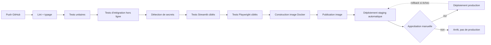

# Sécurité, exploitation, sauvegardes, CI/CD et maîtrise des coûts

> Voir `docs/INDEX.md` pour la navigation. Regroupe les sections Sécurité, Observabilité,
> Sauvegarde/DR, CI/CD et maîtrise des coûts (calcul à la demande, [ADR 0015](../adr/0015-oracle-cloud-infrastructure-payg.md))
> — séparées créeraient des fichiers trop courts et redondants.

## 1. Modèle de menace

| Actif | Menace | Mitigation cible | État aujourd'hui |
|---|---|---|---|
| Clé API EODHD | Fuite (log, Git, réponse affichée) | Variable d'environnement uniquement, jamais loguée | **Déjà respecté** (`provider_config.py`, statut "configuré/non configuré" seulement) |
| Identifiants IG | Fuite, session live accidentelle | Env uniquement, `BACKTEST_IG_ENVIRONMENT=demo` vérifié avant tout appel réseau, aucun token sur disque | **Déjà respecté** (`ig/config.py`, `client.logout()` efface toujours les tokens mémoire) |
| Dépôt GitHub | Secret commité par erreur | `.gitignore` déjà strict, détection de secrets en CI (section 4) | Partiellement — `.gitignore` déjà bon, pas encore de scan CI automatisé |
| Serveur de calcul | Accès non autorisé, exposition réseau | HTTPS, pare-feu, moindre privilège, accès admin séparé | Absent (pas de serveur aujourd'hui) |
| Variables d'environnement serveur | Fuite via logs/erreurs mal gérées | Jamais loguer une valeur de secret, seulement son statut | À appliquer au serveur comme déjà fait pour EODHD/IG |
| Logs applicatifs | Fuite de secrets dans les logs | Filtrage systématique avant écriture | À spécifier pour les futurs logs structurés |
| Sauvegardes | Vol/accès non autorisé | Chiffrement des sauvegardes sensibles | À implémenter Phase 1 |
| Fichiers de résultats | Corruption, perte | Sauvegarde sélective, contrôle d'intégrité | À implémenter |
| Base PostgreSQL | Corruption, accès non autorisé | Sauvegarde testée, accès restreint par rôle | À implémenter (base pas encore créée) |
| Interface web | Accès non authentifié | Authentification (Phase 8 si multi-utilisateur), blocage après échecs répétés | Absent aujourd'hui (mono-utilisateur local) |
| Dépendances Python | Vulnérabilité connue | Mise à jour régulière, `pip audit` en CI | Absent aujourd'hui |
| Images Docker | Vulnérabilité, image obsolète | Reconstruction régulière, scan | Sans objet (pas encore de Docker) |
| Terminal / poste local | Exposition de secrets via l'historique shell | Ne jamais passer un secret en argument de ligne de commande | Déjà respecté (env only, jamais en CLI arg dans les scripts existants) |
| Instance/worker OCI oublié en fonctionnement | Facture imprévue, ressource non comptabilisée | Arrêt automatique après inactivité + arrêt forcé après durée maximale (protection technique, pas seulement une alerte) — voir §7 | Absent aujourd'hui (aucune instance OCI créée) |
| Compte OCI (accès facturation/ressources) | Accès non autorisé, création illimitée de ressources | Permissions minimales, quotas de ressources (nombre max de workers/vCPU) — voir §7 | Absent aujourd'hui (aucun compte créé dans cette mission) |

## 2. Règles absolues (déjà en vigueur, à ne jamais régresser)

- Aucun secret dans Git — **déjà respecté** (`.gitignore` couvre `.env`, `.env.*`,
  `.streamlit/credentials.toml`, `settings/data_providers.json`).
- Aucun secret dans les logs — **déjà respecté** pour EODHD/IG (statut seulement, jamais de
  valeur, même masquée).
- Aucun token de session IG sur disque — **déjà respecté** (`IgHttpClient`, effacé au `logout()`).
- IG démo uniquement, jamais d'URL live — **déjà respecté structurellement** (`IgClient` ne
  contient aucune méthode d'écriture, `BACKTEST_IG_ENVIRONMENT` vérifié avant tout appel réel).
- Aucune méthode de passage d'ordre — **déjà respecté**, à préserver dans toute évolution future
  du connecteur IG.
- Moindre privilège — à appliquer à PostgreSQL (rôles distincts par service) et au serveur
  (utilisateur non-root pour les conteneurs).
- Séparation staging/production — voir ADR 0012.
- HTTPS — via le reverse proxy (voir `DEPLOYMENT_ARCHITECTURE.md`).
- Sauvegardes chiffrées lorsque nécessaire — pour les dumps PostgreSQL et toute donnée sensible.
- Restauration testée — voir §4, obligatoire avant de considérer une sauvegarde fiable.

## 3. Observabilité

### Ce qui doit être observable dès le staging (Phase 1)

- Durée de chaque job, statut (déjà partiellement via `progress.json`/`meta.json`).
- CPU/RAM/disque du serveur.
- Erreurs fournisseurs (EODHD/IG) — déjà partiellement extraites (`error_code`, voir connecteur
  IG existant) mais pas encore centralisées.
- Workers bloqués (aucun mécanisme aujourd'hui — dépend du choix de file de travaux, ADR 0006).
- Échecs de sauvegarde.
- Disponibilité de l'application (l'interface répond-elle ?).

### Ce qui peut attendre la production

- Tableaux de bord avancés multi-utilisateurs.
- Alertes fines par seuil (à définir une fois des données réelles de charge disponibles).
- Corrélation multi-nœuds (pertinent seulement au niveau 2 de déploiement).

### Principe de corrélation

Toute entrée de log doit pouvoir être reliée à un `job_id` quand elle concerne un job — déjà en
partie le cas (`logs.txt` par job directory) ; à étendre aux futurs logs structurés du serveur.

### Rétention des logs

Politique précise non tranchée — voir `docs/roadmap/DECISION_BACKLOG.md`. Principe : les logs
applicatifs génériques ont une rétention courte (semaines) ; les `logs.txt` par job restent liés
au cycle de vie du job directory lui-même (archivage/suppression via Maintenance, mécanisme déjà
existant côté fichiers).

## 4. CI/CD (GitHub Actions — description, non implémenté dans cette mission)

Jobs (description, pas de fichier YAML créé dans cette mission) : compilation/lint, tests
unitaires (déjà 53 fichiers existants à intégrer), tests d'intégration hors ligne (jamais de vrai
appel réseau IG/EODHD en CI — cohérent avec `tests/conftest.py` qui isole déjà les variables
d'environnement sensibles), détection de secrets (nouveau), format, tests Streamlit/Playwright
ciblés (sur les parcours critiques), build Docker, déploiement staging automatique, **approbation
manuelle obligatoire avant production** (cohérent avec ADR 0012), rollback documenté en cas
d'échec post-déploiement.

## 5. Sauvegarde et reprise après sinistre

| Donnée | Fréquence | Rétention | Chiffrement | Localisation |
|---|---|---|---|---|
| Base PostgreSQL | Quotidienne (dump) | À définir (`DECISION_BACKLOG.md`) | Oui | Hors serveur |
| Données EODHD brutes coûteuses en quota | Périodique | Longue (retéléchargement coûteux en quota) | Selon sensibilité | Hors serveur |
| Résultats de jobs importants (Champions) | Après promotion | Longue | Non nécessaire (pas de secret) | Hors serveur |
| Manifestes | Avec les résultats | Longue | Non nécessaire | Hors serveur |
| Configuration/secrets serveur | À chaque changement | Courte, versionnée séparément | Oui | Coffre séparé, jamais dans la sauvegarde de données |

RPO/RTO cibles : à définir précisément lors du dimensionnement Phase 1 (dépend du coût d'un
retéléchargement EODHD vs du coût d'une sauvegarde plus fréquente) — voir
`docs/roadmap/DECISION_BACKLOG.md`.

Procédures de reprise à documenter et **tester réellement** (pas seulement écrire) en Phase 1 :
panne serveur (redéploiement depuis GitHub + Docker Compose + restauration des données),
corruption PostgreSQL (restauration du dernier dump), perte Redis (la file étant reconstructible
depuis l'état des job directories restants, pas de perte de données définitive attendue si le
contrat de fichiers est respecté), perte d'un worker (repris par un autre, voir
`COMPUTE_AND_JOBS.md`), perte du volume de données (restauration depuis sauvegarde + retéléchargement
EODHD si nécessaire).

### Distinction retéléchargeable / coûteux / irremplaçable

- **Retéléchargeable sans coût notable** : CSV historiques déjà exportés depuis MT5 par
  l'utilisateur (à condition que la source MT5 reste disponible).
- **Coûteux à reconstruire** : historique EODHD téléchargé (quota limité), snapshots avec
  provenance déjà vérifiée.
- **Irremplaçable** : résultats de campagnes de validation longues (walk-forward, Monte-Carlo),
  décisions Champion et leur justification, configuration exacte ayant produit un résultat de
  référence.

## 6. Environnements et secrets — renvoi

Voir ADR 0012 pour la séparation Local/Staging/Production et la politique de promotion.

## 7. Maîtrise des coûts (OCI, calcul à la demande)

Conséquence directe d'[ADR 0015](../adr/0015-oracle-cloud-infrastructure-payg.md) : un modèle
Pay As You Go transforme un risque de sur-provisionnement (serveur dédié inutilisé) en risque de
**facture imprévue** si le calcul à la demande n'est pas strictement contrôlé. Exigences cibles,
non implémentées dans cette mission :

| Exigence | Rôle |
|---|---|
| Estimation du coût avant une grosse optimisation | Empêche une campagne lancée sans visibilité sur son coût probable |
| Durée maximale configurable d'un job | Borne le pire cas même si l'estimation était fausse |
| Nombre maximal de workers simultanés | Empêche une explosion non contrôlée du nombre d'instances |
| Nombre maximal de vCPU autorisés (global) | Plafond dur indépendant du nombre de workers |
| Arrêt automatique après inactivité | **Protection technique indépendante** — voir principe ci-dessous |
| Arrêt forcé après une durée maximale | Filet de sécurité même si l'arrêt sur inactivité échoue |
| Alertes budgétaires | Signal précoce — **jamais la seule protection** (voir principe ci-dessous) |
| Journal des heures de calcul | Base factuelle pour réévaluer Hetzner (critère de l'ADR 0015) |
| Tableau de consommation | Visibilité utilisateur avant/après usage |
| Confirmation utilisateur avant une opération coûteuse | Aucun démarrage de campagne intensive sans accord explicite |
| Procédure d'arrêt d'urgence | Reprise de contrôle manuelle immédiate si un mécanisme automatique échoue |
| Aucune création illimitée de workers | Quota dur, pas une simple recommandation |

**Principe non négociable** : les alertes budgétaires sont un signal, **pas une protection** —
une alerte peut être ignorée ou arriver après le fait. L'**arrêt automatique après inactivité**
et l'**arrêt forcé après durée maximale** doivent être des mécanismes techniques qui agissent
indépendamment de toute action humaine (voir le cycle à la demande dans
[`COMPUTE_AND_JOBS.md`](COMPUTE_AND_JOBS.md) §6, étape 10). Aucune instance de calcul ne doit
pouvoir rester active indéfiniment sans qu'un de ces deux mécanismes techniques ne la stoppe.

Ces exigences sont des critères d'entrée pour la Phase 1 (voir `docs/roadmap/MASTER_ROADMAP.md`,
Phase 0 — critère Go/No-Go) : le calcul à la demande ne doit pas être activé en usage réel avant
que ces protections existent.
