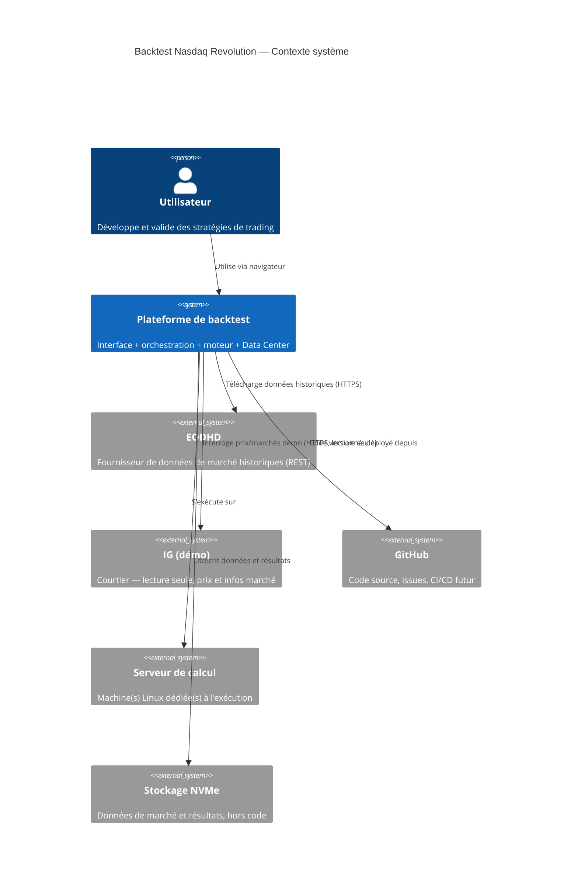
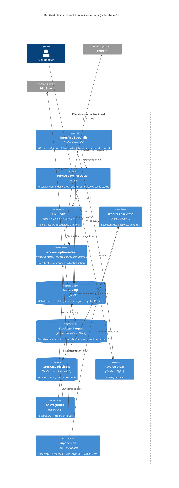
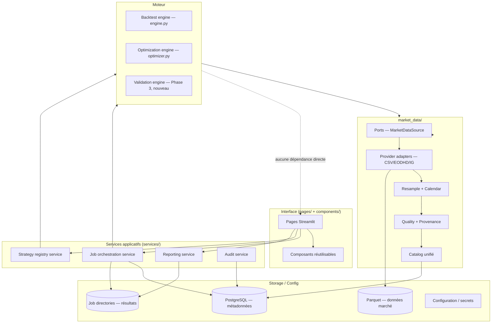

# Architecture cible

> Voir `docs/INDEX.md` pour la navigation. Ce document couvre les diagrammes C4 Contexte,
> Conteneurs et Composants. Le déploiement détaillé est dans
> [`DEPLOYMENT_ARCHITECTURE.md`](DEPLOYMENT_ARCHITECTURE.md), le cycle de vie des jobs dans
> [`COMPUTE_AND_JOBS.md`](COMPUTE_AND_JOBS.md), le flux de données dans
> [`DATA_ARCHITECTURE.md`](DATA_ARCHITECTURE.md). Décision structurante principale :
> [ADR 0005](../adr/0005-modular-monolith-with-separated-workers.md) (monolithe modulaire) ;
> isolation du module Options : [ADR 0011](../adr/0011-options-module-isolation.md).

## 1. Principes évalués (confrontés au dépôt réel, décisions formalisées en ADR)

| Principe proposé | Confronté au dépôt | Décision |
|---|---|---|
| Monolithe modulaire comme base | `engine.py`/`optimizer.py` déjà découplés de Streamlit ; `job_launcher.py` déjà une frontière process réelle | **Retenu** — ADR 0005 |
| Séparation interface / orchestration / moteur / données | Partiellement déjà là (job_launcher sépare UI et calcul pour l'optimisation ; pas pour le backtest simple) | **Retenu**, à étendre au backtest simple (voir `DECISION_BACKLOG.md`) |
| Streamlit jamais moteur d'exécution | Aujourd'hui le backtest simple s'exécute dans le thread Streamlit — violé pour ce cas précis | **Retenu comme cible**, écart actuel documenté, pas corrigé dans cette mission |
| File de travaux asynchrone | Absente aujourd'hui (queue en dur à 1 job) | **Retenu** — ADR 0005, technologie en `Decision pending` — ADR 0006 |
| Workers de calcul séparés | `ProcessPoolExecutor` déjà interne à un job, mais mono-machine | **Retenu**, extension multi-machines |
| Redis + RQ ou Celery | Aucun prototype existant | **Decision pending** — ADR 0006, benchmark requis |
| PostgreSQL pour les métadonnées | Aucune base aujourd'hui, catalogue JSON mort en production | **Retenu** — ADR 0007 |
| Données de marché en Parquet sur volume dédié | Parquet utilisé à un seul endroit aujourd'hui (EODHD normalisé) | **Retenu**, uniformisation — ADR 0008 |
| Conservation du job directory comme artefact portable | Contrat déjà stable, documenté, avec compatibilité descendante | **Retenu sans changement** |
| Conteneurisation Docker | Absente aujourd'hui | **Retenu** — ADR 0009 |
| Docker Compose pour la première version serveur | — | **Retenu** — ADR 0009 |
| Reverse proxy Caddy ou Nginx | Absent aujourd'hui | **Retenu**, choix technique en `DECISION_BACKLOG.md` |
| Environnements local/staging/production | Un seul environnement aujourd'hui | **Retenu** — ADR 0012 |
| Architecture provider-agnostic | Déjà vrai côté port `MarketDataSource`, pas encore côté IG (registre absent) | **Retenu**, à étendre |
| Compatibilité Linux | Meilleure que redouté (voir `CURRENT_STATE.md` §3) | **Confirmé faisable sans réécriture majeure** |
| Stockage brut immuable | Déjà vrai côté EODHD, absent côté CSV local | **Retenu**, extension — ADR 0008 |
| Snapshots de données, hashes de provenance | Existent mais non reliés au manifeste de backtest | **Retenu**, correction du branchement — ADR 0008 |
| Reprise après interruption | Mécanisme moteur dormant | **Retenu**, branchement à planifier — voir `COMPUTE_AND_JOBS.md` |
| Architecture événementielle déterministe pour le moteur | Le moteur actuel (bar-par-bar, `on_bar()`) est déjà déterministe par construction | **Confirmé déjà conforme**, aucun changement requis |
| Absence de dépendance directe du moteur envers Streamlit/EODHD/IG/chemin physique | Déjà vrai pour `engine.py`/`strategies/*` (aucun `import streamlit`) ; `path_resolver` isole les chemins | **Confirmé déjà conforme** |
| Sécurité par variables d'environnement ou coffre de secrets | Déjà en place pour EODHD/IG (clé API en env, jamais sur disque pour les tokens IG) | **Retenu**, étendu à PostgreSQL/Redis |
| IG démo et lecture seule uniquement, aucune fonction de trading live | Déjà vrai structurellement (aucune méthode d'écriture dans `IgClient`) | **Confirmé déjà conforme, à ne jamais régresser** |

Refus explicite de la multiplication de microservices : un serveur unique en Phase 1, des
frontières de module claires plutôt que des services réseau séparés pour chaque responsabilité.

## 2. Diagramme C4 — Contexte

## 3. Diagramme C4 — Conteneurs

## 4. Diagramme de composants (vue interne)

Principe clé (confirmé déjà respecté par le code actuel, voir §1) : le moteur (`ENGINE`) ne
dépend jamais de l'UI, de Streamlit, ni d'un fournisseur de données précis — seulement du port
`MarketDataSource`.

## 5. Compatibilité garantie avec l'existant

Cette architecture cible ne casse aucun des éléments suivants (contrainte explicite) :
chargement CSV historique, contrat des job directories, `progress.json`, `config_used.json`,
`results.csv`, `best_strategies.csv`, `metrics.json`, `report.html`, `archive.zip`, stratégies et
résultats déjà existants, fonctionnement local (sans serveur), Data Center, connecteurs EODHD/IG
démo, manifestes reproductibles (une fois corrigés — ADR 0008), tests existants.
