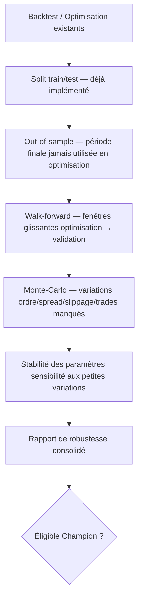
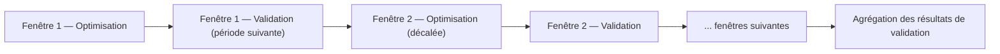

# Fiabilité scientifique du backtest — architecture de validation

> Voir `docs/INDEX.md` pour la navigation. Référence `docs/superpowers/specs/2026-05-19-backtest-optimizer-design.md`,
> qui note déjà explicitement que le walk-forward ("Mode 5") et le Monte-Carlo sont reportés en
> V2 — **jamais implémentés à ce jour** (confirmé par l'audit du 2026-08-06). Ce document ne
> duplique pas cette spec, il en prend la suite.

## 1. Ce qui existe déjà (à ne pas refaire)

- **Split train/test** : implémenté (voir `docs/superpowers/specs/2026-05-19-...md` §7).
- **Filtres éliminatoires et pondération de score anti-overfitting** (4 types de pénalités,
  plafond cumulé 60 %) : implémentés (`scoring.py`, même spec §5-6).
- **Analyse de sensibilité** (écart-type filtré / corrélation de Spearman) : implémentée selon le
  mode d'optimisation.

## 2. Composants à concevoir (non implémentés — architecture uniquement)

### Walk-forward

### Monte-Carlo

Simulations à concevoir : ordre différent des trades, variations de spread, variations de
slippage, trades manqués (exécution ratée simulée), exécutions moins favorables, séries de
pertes inhabituelles. Sortie attendue : distribution de résultats (pas une valeur unique),
permettant d'estimer un intervalle de confiance sur la performance plutôt qu'un chiffre isolé.

### Out-of-sample

Trois périodes disjointes et strictement ordonnées dans le temps : apprentissage → validation →
période finale jamais utilisée avant le verdict final. Le train/test déjà implémenté couvre
apprentissage/validation ; la période finale "jamais utilisée avant" est un concept **nouveau**,
absent aujourd'hui.

## 3. Modèle réaliste d'exécution — ce qui existe vs ce qui manque

| Élément | État |
|---|---|
| Spread | Fait vérifié — déjà pris en compte (`CONTEXT.md` : Spread confirmé) |
| Slippage | Fait vérifié — déjà pris en compte |
| Commission | Absent (`CONTEXT.md` : "À confirmer" — seuls spread/slippage modélisés) |
| Latence | Absent |
| Financement overnight | Absent |
| Dividendes | Connecteur EODHD existe, non branché à l'exécution (voir `DATA_ARCHITECTURE.md`) |
| Gaps | Non vérifié explicitement dans le moteur — à auditer avant d'affirmer un comportement |
| Tailles minimales / arrondis courtier | Absent |
| Liquidité | Absent |
| Horaires de cotation / fermeture anticipée | Dépend du calendrier de marché — non branché (ADR 0013) |
| Absence de cotation | Dépend du même branchement |

Chacun de ces éléments manquants est un **candidat de ticket Phase 3**, pas une implémentation de
cette mission (voir `docs/roadmap/EPICS_AND_TICKETS.md`).

## 4. Prévention des biais

| Biais | Mécanisme cible |
|---|---|
| Look-ahead bias | Le moteur actuel (`on_bar()` bar-par-bar, indicateurs pré-calculés sans fuite future — à confirmer précisément par un audit ciblé, non fait dans cette mission) doit être audité explicitement avant la Phase 3 |
| Survivorship bias | Nécessite les titres radiés (connecteur existe, non branché — voir `DATA_ARCHITECTURE.md`) |
| Data snooping | Contrôle du nombre de combinaisons testées avant qu'un résultat soit jugé significatif (garde-fou `max_combinations_warning` déjà présent dans la spec de mai 2026, à étendre) |
| Overfitting | Pénalités déjà présentes (scoring), walk-forward et Monte-Carlo à ajouter pour un contrôle plus fort |

## 5. Conditions minimales avant qu'une stratégie devienne "Champion"

Le concept "Champion" existe déjà fortement dans le code (`champion_*.py`) mais ses règles
précises restent une question ouverte (voir `docs/architecture/DOMAIN_MODEL.md` §5). Cette
mission propose, sans trancher définitivement, les conditions minimales suivantes — à valider
explicitement avec l'utilisateur en session `/domain-modeling` dédiée :

1. Split train/test déjà en place (déjà vrai aujourd'hui).
2. Passage par au moins une validation out-of-sample sur une période jamais utilisée en
   optimisation (nouveau).
3. Ratio performance in-sample / out-of-sample dans une plage jugée acceptable (seuil à définir).
4. Walk-forward complété sans dégradation disqualifiante (nouveau, une fois implémenté).
5. Monte-Carlo complété avec un intervalle de confiance jugé acceptable (nouveau, une fois
   implémenté).
6. Stabilité des paramètres vérifiée (performance médiane autour du "champion" pas radicalement
   différente du point testé, signe que le résultat n'est pas un pic isolé).

Tant que 4 et 5 ne sont pas implémentés, une stratégie ne peut être qualifiée que de "Champion
provisoire (validation scientifique incomplète)" — étiquette explicite à porter dans l'UI/rapport,
jamais une promotion silencieuse au même niveau qu'une validation complète.

## 6. Tests Playwright — stratégie générale

Les tests Playwright valident les parcours UI (voir le détail par espace fonctionnel dans
`docs/architecture/UI_UX_ARCHITECTURE.md` §2, colonne "Tests Playwright futurs"). Principe
général : chaque migration d'onglet (`ADR 0010`) se termine par un test Playwright du parcours
concerné, canal `msedge`, avant retrait du code équivalent de `app.py` — pattern déjà établi et
documenté dans `AI_HANDOFF.md` pour la validation visuelle du Data Center.
