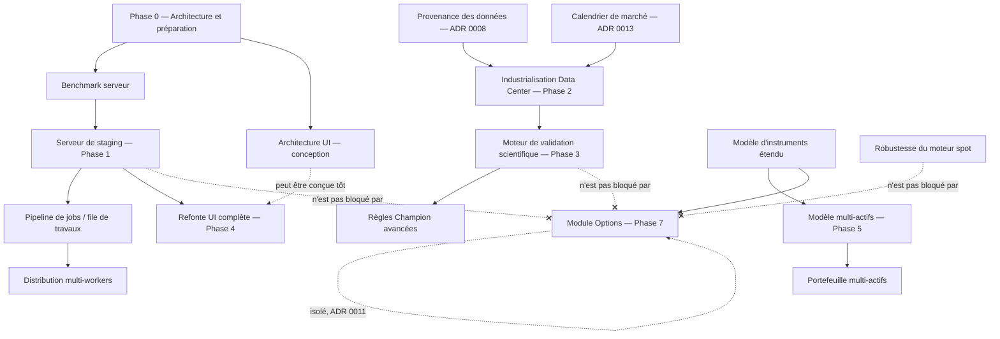

# Carte des dépendances entre chantiers

> Voir `docs/INDEX.md` pour la navigation. Complète `MASTER_ROADMAP.md` (dépendances par phase)
> par une vue transversale des grands chantiers.

## Règles de dépendance explicites (contraintes de l'utilisateur, formalisées)

1. **Le serveur de staging précède les gros benchmarks** — un benchmark représentatif (1M
   bougies, 1000 combinaisons, 8 workers) n'a de sens qu'une fois un serveur réel disponible ;
   les mesures locales ne remplacent pas les mesures serveur.
2. **Le pipeline de jobs précède la distribution des workers** — ADR 0005/0006 doivent être
   posées avant d'ajouter des workers sur plusieurs machines.
3. **La provenance des données précède certaines validations scientifiques** — un walk-forward ou
   Monte-Carlo sur des données sans hash/manifeste fiable produirait des résultats non
   reproductibles, donc non crédibles (ADR 0008 avant Phase 3).
4. **Le moteur de validation précède les règles Champion avancées** — les règles Champion
   complètes (`TEST_AND_VALIDATION_ARCHITECTURE.md` §5) ne peuvent être appliquées avant que
   walk-forward/Monte-Carlo existent.
5. **L'architecture UI peut être conçue tôt, la refonte complète vient après la stabilisation des
   services** — `UI_UX_ARCHITECTURE.md` est livré dans cette mission (Phase 0), mais la migration
   de code (ADR 0010) attend la Phase 4.
6. **Le multi-actifs précède le portefeuille** — un `Portfolio` suppose plusieurs `Instrument`
   déjà modélisés par classe d'actif.
7. **Le modèle d'instruments précède les options** — `OptionContract` a besoin d'un sous-jacent
   déjà modélisé, mais le module Options reste isolé (ADR 0011) — il consomme le modèle
   d'instrument sans jamais coupler son moteur au moteur spot.
8. **Le module Options ne bloque ni le serveur, ni la robustesse du moteur spot** — contrainte
   absolue de l'utilisateur, respectée structurellement par l'isolation ADR 0011.
