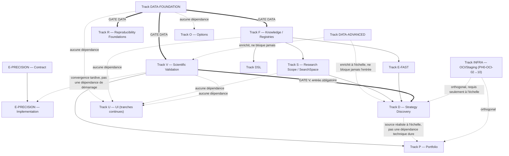

# Feuille de route générale (Master Roadmap) — AlphaForge V2

> Voir `docs/INDEX.md` pour la navigation. Détail des tickets : `EPICS_AND_TICKETS.md` (non
> modifié par cette révision). Dépendances transversales : `DEPENDENCY_MAP.md` (non modifié).
> Risques : `RISK_REGISTER.md`. Décisions ouvertes : `DECISION_BACKLOG.md`. Modèle de domaine
> source de vérité : `docs/architecture/DOMAIN_MODEL.md` (révisé, `AF-DOM-01-QC` validé,
> 2026-08-14).

## Recalcul complet (2026-08-14, mission `AF-RM-01`)

> **Cette roadmap remplace l'ancienne organisation linéaire en 9 Phases (0 à 8)**, conservée en
> archive historique en fin de document (§ "Ancienne roadmap — mapping vers la nouvelle
> organisation") pour ne perdre aucune information, mais **n'est plus la structure de référence**.
>
> **Pourquoi ce recalcul** : la cible **AlphaForge V2** introduit des sous-domaines (Strategy
> Knowledge Base, Registries, Research Scope, Strategy Discovery...) dont les dépendances réelles
> ne suivent pas l'ordre historique des anciennes Phases — l'ordre dans lequel un chantier
> apparaissait avant un autre dans l'ancienne roadmap n'était pas une preuve de dépendance
> technique ou scientifique. Cette révision recalcule l'ordre à partir du **graphe de dépendances
> réel** entre **tracks parallélisables**, pas d'une chaîne linéaire.
>
> **PH0-OCI-01 est définitivement clos** (validation Linux réelle sur OCI, 2026-08-14, commit
> `9e38dd8` puis `4e373c3` — voir `LINUX_PORTABILITY_REPORT.md` §15 et `EPICS_AND_TICKETS.md`) et
> **n'apparaît plus jamais comme travail restant** dans ce document. Les tickets `PH0-OCI-02` à
> `PH0-OCI-10` restent ouverts et **préservés tels quels** (aucune renumérotation, aucune
> recréation) — ils forment le track `INFRA` ci-dessous.

## Quality Gate `AF-RM-01-QC` (2026-08-15) — corrections apportées

Revue ciblée dépendances/données via `codebase-design` + `domain-modeling` (voir historique Git
pour le détail complet). Verdict : le Data Center existant (`market_data/`, connecteurs
EODHD/IG/CSV déjà validés) était noyé dans Track `R` sous une étiquette "aucun code" factuellement
inexacte, et deux arêtes du graphe (`R --> F`, `R --> E-PRECISION`-Contract) avaient le sens
inversé pour leur partie réellement dépendante. Corrections : extraction d'un **Track `DATA`**
autonome (scindé `DATA-FOUNDATION`/`DATA-ADVANCED`) ; `GATE R` renommée **`GATE DATA`** et
réattribuée au track qui produit réellement sa preuve de sortie (`content_hash`/`DatasetVersion`) ;
`E-PRECISION`-Contract reconnu comme démarrable sans aucun prérequis (ni `DATA` ni `R`) ; `GATE D`
reformulée en multi-critères ; wording `Track U` et déclencheurs `INFRA` précisés. Aucune capacité
ni track supprimé — voir §2-§5 et §7 ci-dessous pour le détail intégral.

---

## 1. Principe directeur (non négociable, structure les gates)

```
FIABILITÉ → REPRODUCTIBILITÉ → SÉCURITÉ → ARCHITECTURE → VALIDATION SCIENTIFIQUE
→ PERFORMANCE → STRATEGY DISCOVERY → PORTFOLIO → ERGONOMIE → FONCTIONNALITÉS
```

Ce n'est pas qu'un ordre éditorial : chaque **gate** de la section 5 traduit concrètement une
étape de cette hiérarchie. En particulier, **Strategy Discovery ne peut pas franchir GATE D avant
que GATE V soit passée** — ce n'est pas seulement une dépendance technique, c'est une exigence de
principe explicitement voulue par l'utilisateur (tester plus de combinaisons ne rend pas un
backtest plus fiable ; voir `TEST_AND_VALIDATION_ARCHITECTURE.md`).

---

## 2. Tracks (remplace les anciennes Phases 0-8)

| Track | Nom | Sous-domaine(s) `DOMAIN_MODEL.md` | Statut actuel |
|---|---|---|---|
| **DATA** | Data Center (Provenance & Qualité) | §2 (Dataset/DatasetVersion/DatasetSnapshot, DataQualityReport, MarketCalendar, CorporateAction) | **EXISTING** pour l'ingestion brute (module `market_data/`, 31 fichiers, connecteurs EODHD/IG/CSV déjà validés — commit `a28a6e5`) ; PARTIAL/PROPOSED pour `content_hash`/`DatasetVersion` immuables. Scindé `DATA-FOUNDATION` (étroit, alimente `GATE DATA`) / `DATA-ADVANCED` (large, aucun gate) — voir §3 |
| **R** | Reproducibility & Research Foundations | §7 (Experiment/ResearchRun), §12 (Holdout/DatasetSplitPlan) | PROPOSED — fondation, aucun code. **Consomme** le `DatasetVersion` produit par `DATA`, ne le produit pas |
| **F** | Strategy Knowledge / Registries | §3 (Knowledge Base), §4 (Registries), §5 (StrategyTemplate/StrategyDefinition) | PROPOSED, additif à l'existant |
| **V** | Scientific Validation | §11 (Validation scientifique) | PROPOSED, architecture déjà préparée (`TEST_AND_VALIDATION_ARCHITECTURE.md`), 0 % implémenté |
| **S** | Research Scope / SearchSpace | §6 | PROPOSED |
| **E-FAST** | Fast Backtest / Feature Computation | Architecture/performance — pas un sous-domaine métier propre (voir `codebase-design`, confirmé en revue) | PROPOSED |
| **E-PRECISION** | Precision Execution | §10 (ExecutionModel) | PROPOSED — `engine.py` reste **CURRENT REFERENCE ENGINE, IMPLEMENTED + TESTED**, jamais renommé Precision Engine avant conformance testée |
| **D** | Strategy Discovery | §5 (origine "générée"), §8 (SearchMethod), §9 (CandidateStrategy) | PROPOSED — algorithmique, jamais IA générative autonome (différée) |
| **P** | Portfolio | §14, touche §15 (StrategyHealth, FUTURE) | PROPOSED |
| **U** | UI / Strategy Laboratory | Présentation — pas un sous-domaine métier (`UI_UX_ARCHITECTURE.md`, ADR 0010 Proposed) | DOCUMENTED (architecture cible existante), migration non commencée |
| **DSL** | Strategy Authoring | §5 (compilation vers `StrategyDefinition`) | DECISION PENDING (ADR 0014) |
| **O** | Options / Derivatives | §17, isolé | PROPOSED, isolation actée (ADR 0011 Proposed) |
| **INFRA** | OCI / Staging / Workers | Infrastructure — pas un sous-domaine métier | Tickets `PH0-OCI-02`→`PH0-OCI-10` **existants, préservés, non modifiés ici** |

**Aucune capacité AlphaForge majeure ne disparaît** — chaque track ci-dessus couvre exactement ce
que couvraient les anciennes Phases 1 à 8, réorganisé par dépendance réelle (voir mapping §7).

---

## 3. Graphe de dépendances (vérifié sans cycle — `codebase-design`, 2026-08-14)



**Correction `AF-RM-01-QC` (2026-08-15)** : les arêtes `R --> F` et `R --> E-PRECISION`-Contract de
la version `AF-RM-01` avaient le sens inversé pour leur partie réellement dépendante. `codebase-design`
confirme que `market_data/` (EODHD/IG/CSV, 3 adapters déjà en place) est un **seam réel et déjà
profond** — pas une frontière inventée — distinct du module `R` (Experiment/ResearchRun, zéro
code). `F` a besoin d'un dataset identifiable pour cataloguer des `Feature`/`Indicator`, pas du
mécanisme `Experiment`/`ResearchRun` de `R`. `E-PRECISION`-Contract n'a besoin que du Domain Model
(déjà stabilisé, `AF-DOM-01-QC`) — **aucune dépendance à `DATA` ni à `R`**. Et c'est `R` qui
dépend de `DATA` (un `ResearchRun` référence un `DatasetVersion` par hash), jamais l'inverse.
`domain-modeling` confirme que la frontière DATA=§2 / R=§7+§12 respecte les sous-domaines déjà
posés dans `DOMAIN_MODEL.md` (aucun concept mal placé des deux côtés).

**Points vérifiés explicitement (revue adversariale) :**
- **Pas de cycle Validation ↔ Precision** : `V` démarre sur `CURRENT REFERENCE ENGINE` (déjà
  implémenté) sans attendre `E-PRECISION` ; seule une future étape de durcissement (§5, Wave 4)
  réunit les deux — c'est une convergence en aval, pas une dépendance de démarrage.
- **Portfolio ne dépend pas artificiellement de Discovery** : dépendance **technique** réelle =
  `V` + au moins 2 `StrategyDefinition` validées (peuvent venir de `F` seul, hand-authored) ;
  dépendance **produit** réaliste = `D` sera la source principale à l'échelle en pratique — les
  deux sont montrées séparément, jamais confondues.
- **DSL n'est prérequis à rien** : ni `D` (le Combination Engine utilise une représentation
  déclarative interne sans DSL utilisateur décidé, ADR 0014 reste `Decision pending`), ni `F`.
- **Options ne bloque jamais le spot** : isolé, aucune arête entrante depuis `V`/`E-PRECISION`.
- **DATA-ADVANCED ne bloque jamais `V`/`F`/l'entrée dans `D`** — mais nuance issue du scénario
  mental F (§ ci-dessous) : à grande échelle, `D` bénéficie concrètement d'une `DATA-ADVANCED`
  plus riche (multi-instrument, corporate actions complètes) sans que ce soit un gate.
- **`INFRA` ne bloque aucun travail faisable en local** : `DATA-FOUNDATION`/`R`/`F`/`V`/`S`/
  `E-FAST`(prototype)/`D`(petite échelle) fonctionnent sur poste local ou une seule instance
  (déjà prouvé par `PH0-OCI-01` : pipeline identique Windows/OCI sans infra distribuée). `INFRA`
  ne devient réellement bloquant que pour :
  - jobs asynchrones à l'échelle (ADR 0006, `Decision pending`) ;
  - PostgreSQL en production (ADR 0007, `Proposed`) ;
  - Docker Compose de staging (ADR 0009, `Proposed`) ;
  - workers distribués ;
  - `Discovery` à grande échelle (nombreux workers) ;
  - staging multi-utilisateur.

---

## 4. Gates Go/No-Go

| Gate | Condition de sortie précise | Bloque |
|---|---|---|
| **GATE DATA** — **STATUT : `PASS` (2026-08-15)** *(renommée depuis `GATE R`, `AF-RM-01-QC`)* | Au moins un nouveau pipeline produit, de bout en bout, un `content_hash` réel non vide **et** une référence de snapshot content-addressed identifiable (`snapshot_id`) **et** les bornes du dataset source (`period_start`/`period_end`), pour le dataset déjà utilisé (`nasdaq_3m.csv`), sans casser le contrat de fichiers d'aucun job historique existant. **Reconciliation `AF-RM-01-QC`→checkpoint DATA (2026-08-15)** : cette formulation absorbe la prose §5/"Prochaine action unique" ci-dessous ("content_hash + DatasetVersion identifiable") — `snapshot_id` **est** la référence de snapshot identifiable minimale visée, **pas** un catalogue `DatasetVersion` persistant/interrogeable (celui-ci reste `FUTURE`, `DATA-ADVANCED`, voir `EPICS_AND_TICKETS.md` §10). Preuve : `AF-DATA-01`→`AF-DATA-04A`, 10/10 critères, Perfect Revolution non régressée (114 trades) | `R`, `V`, `F` — **pas** `E-PRECISION`-Contract (aucune dépendance réelle, voir §3) |
| **GATE V** | `OOS`/`WalkForward`/`MonteCarlo`/`ParameterStability` produisent tous une `ValidationEvidence` réelle sur `CURRENT REFERENCE ENGINE` + Perfect Revolution ; le lifecycle Champion peut référencer cette preuve pour au moins un cas réel | `D` (entrée obligatoire), `P` |
| **GATE D** | Une méthode de recherche sophistiquée démontre sa valeur face à sa `Random Baseline`, à budget de calcul comparable — **pas nécessairement par la seule performance hors-échantillon** : qualité, efficacité de recherche, couverture, stabilité des paramètres ou coût de recherche comptent aussi, individuellement ou combinés | Toute présentation de résultat Discovery comme "significatif" |
| **GATE PRECISION** | L'implémentation `E-PRECISION` passe les tests différentiels/conformance contre `CURRENT REFERENCE ENGINE` sur l'intégralité du contrat défini, sans divergence non expliquée | Renommage en "Precision Engine, validé" |
| **GATE CHAMPION** | `ValidationEvidence` (niveau GATE V) + `ValidationPolicyVersion` explicite + provenance complète (`DatasetVersion`/`StrategyDefinition`/`git_sha`/seed). Passage par `E-PRECISION` comme condition supplémentaire = **PROPOSED TARGET GATE, non tranché** — pas une règle déjà appliquée | Promotion au statut `CHAMPION` |
| **GATE PORTFOLIO** | Au moins 2 `StrategyDefinition` ayant chacune franchi `GATE CHAMPION` (indépendamment de leur origine — `F` ou `D`) | Mécanique de capital partagé |

---

## 5. Delivery waves

### Wave 1 — DATA-FOUNDATION (mène) + démarrage parallèle R/V/F + E-PRECISION-Contract (indépendant)

- **Objectif** : lever le verrou de provenance des données qui débloque le plus de tracks en aval
  (`R`, `V`, `F`), tout en démarrant immédiatement ce qui n'a strictement aucune dépendance
  (`E-PRECISION`-Contract).
- **Tracks actifs** : `DATA-FOUNDATION` (mène, s'appuie sur le module `market_data/` **déjà
  existant et validé**, pas un chantier from-scratch) ; `E-PRECISION`-Contract démarre le même
  jour, en parallèle, sans attendre `DATA-FOUNDATION` ni `GATE DATA` (dépend uniquement du Domain
  Model, déjà stabilisé) ; `R`, `V`, `F` démarrent dès que `DATA-FOUNDATION` atteint `GATE DATA`.
- **Prérequis** : aucun pour `DATA-FOUNDATION` et `E-PRECISION`-Contract — `DOMAIN_MODEL.md` déjà
  stabilisé (`AF-DOM-01-QC`).
- **Livrables** : `content_hash`/référence de snapshot identifiable (`snapshot_id`, **pas** un
  catalogue `DatasetVersion` persistant — voir §4, réconciliation `AF-RM-01-QC`→checkpoint DATA)
  réels branchés sur le dataset déjà utilisé (`nasdaq_3m.csv`) via `market_data/`
  (`DATA-FOUNDATION`) ; règle de compatibilité legacy
  explicite (anciens jobs sans hash restent lisibles) ; fondations `Experiment`/`ResearchRun`,
  `DatasetSplitPlan`/`HoldoutAccessEvent` (`R`) ; premières `ValidationRun` réelles sur Perfect
  Revolution (`V`) ; premiers éléments du Knowledge Base + Strategy Registry additif (`F`,
  `perfect_revolution_v1.py` inchangé) ; `E-PRECISION Contract` rédigé (interface, aucune
  implémentation).
- **Gate de sortie** : **GATE DATA** (pour `R`/`V`/`F`) — **`PASS` (2026-08-15)**, voir §4 et
  `EPICS_AND_TICKETS.md` §10 pour le verdict complet. `E-PRECISION`-Contract n'a pas de gate de
  sortie propre à cette wave — il est simplement stabilisé avant d'être requis en Wave 4.
- **Tests/non-régression** : suite pytest existante (546/546 sous Linux OCI, référence) toujours
  verte ; aucun ancien job/résultat modifié.
- **Risques** : sur-ingénierie prématurée du schéma `Experiment`/`ResearchRun` avant un cas
  d'usage réel — mitigé en gardant `R` au niveau fondation, pas une implémentation complète.
  Confondre `DATA-FOUNDATION` avec un chantier neuf — mitigé en rappelant que le travail réel est
  l'ajout de `content_hash`/versioning sur `market_data/` existant, pas une réécriture.
  **Perfect Revolution non modifiée** dans cette wave.
- **Parallélisable** : `DATA-FOUNDATION` et `E-PRECISION`-Contract n'ont strictement aucune
  dépendance croisée et démarrent le même jour ; `R`, `V`, `F` démarrent dès `GATE DATA` (pas
  besoin d'attendre la fin complète de `DATA-FOUNDATION`, seulement le sous-ensemble minimal :
  `content_hash` + `snapshot_id` identifiable pour le dataset déjà utilisé — **`R`/`V`/`F` sont
  `READY` depuis le `PASS` du 2026-08-15**, voir `EPICS_AND_TICKETS.md` §11-12).

### Wave 2 — Research Scope + Fast Engine foundations

- **Objectif** : donner à `F` (déjà démarré) de quoi être scopé et vectorisé.
- **Tracks actifs** : `S`, `E-FAST` (démarrent une fois `F` a un catalogue minimal réel) ; `V`
  continue en parallèle vers **GATE V** ; `E-PRECISION`-Contract se poursuit si non terminé ;
  `DATA-ADVANCED` peut progresser en tâche de fond dès cette wave (aucun prérequis, aucun gate) —
  sync incrémental EODHD, Dukascopy, corporate actions complètes, calendriers DST/holidays
  avancés, catalogue PostgreSQL — sans jamais bloquer `S`/`E-FAST`/`V`.
- **Prérequis** : `F` a produit au moins quelques `IndicatorVersion`/`FeatureVersion` réelles.
- **Livrables** : modèle `ResearchScope`→`SearchSpace` avec calcul de taille théorique (pas
  d'exécution) ; fondations `E-FAST` (cache versionné par `dataset content_hash + FeatureVersion +
  paramètres + timeframe + version logicielle`, benchmark avant tout choix technique — **pas de
  décision "Polars/Numba obligatoire" imposée ici**).
- **Gate de sortie** : `SearchSpace` calculable de bout en bout sur un `ResearchScope` réel
  (même petit) ; **GATE V** idéalement atteinte avant la fin de cette wave (condition d'entrée de
  la Wave 3, pas de cette wave elle-même).
- **Tests/non-régression** : idem Wave 1. **Perfect Revolution non modifiée.**
- **Risques** : benchmark `E-FAST` biaisé par une machine non représentative — mitigé en
  réutilisant le protocole déjà défini (`BENCHMARK_PLAN.md`).
- **Parallélisable** : `S` et `E-FAST` sont indépendants l'un de l'autre.

### Wave 3 — Strategy Discovery (entrée gatée)

- **Objectif** : premiers candidats générés algorithmiquement, jamais sans preuve comparative.
- **Tracks actifs** : `D`.
- **Prérequis explicites (liste, pas une prose)** :
  1. `F`, `S`, `E-FAST` suffisamment matures (catalogue réel, `SearchSpace` calculable, cache
     opérationnel).
  2. **`GATE V` passée** — condition d'entrée non technique mais non négociable (principe
     directeur §1).
- **Livrables** : `Random Baseline` en premier (toujours), puis Combination Engine progressif
  (paires → triplets → recherche plus sophistiquée), avec comparaison systématique à la baseline
  à budget comparable.
- **Gate de sortie** : **GATE D** pour toute méthode sophistiquée avant présentation de ses
  résultats comme significatifs.
- **Tests/non-régression** : cadre anti-overfitting `FOUNDATION` opérationnel (holdout intouché,
  audit d'accès, nested validation, comptage de candidats, `Random Baseline`, stabilité des
  paramètres, contrôle de complexité — voir §6). **Perfect Revolution non modifiée** — reste
  l'étalon de non-régression du moteur, indépendant de `D`.
- **Risques** : data snooping massif si `GATE V` est contournée sous pression — mitigé par le
  statut de gate explicite, pas une simple recommandation. À grande échelle (nombreux candidats,
  multi-instrument), `D` bénéficie concrètement d'une `DATA-ADVANCED` plus riche (corporate
  actions complètes notamment) — un besoin pratique croissant, jamais un gate technique bloquant
  l'entrée en Wave 3.
- **Parallélisable avec** : `E-PRECISION`-Implementation peut démarrer ici aussi (dépend
  seulement d'`E-PRECISION`-Contract stabilisé, pas de `D` ni de `R`), sans être la priorité
  (principe directeur : Validation/Discovery avant Performance/Precision).

### Wave 4 — Precision & Champion hardening

- **Objectif** : convergence de `V` et `E-PRECISION` vers un Champion pleinement durci.
- **Tracks actifs** : `E-PRECISION`-Implementation (capacités une à une : bid/ask, commissions,
  types d'ordres, intrabar, gaps, sessions, margin, taille minimale — chacune avec test
  différentiel/conformance contre `CURRENT REFERENCE ENGINE`) ; application du framework `V` aux
  candidats produits par `D`.
- **Prérequis** : `GATE D` atteinte pour au moins une méthode ; `E-PRECISION`-Contract stabilisé.
- **Livrables** : **GATE PRECISION** ; premiers `Champion` réels avec `ValidationEvidence` +
  `ValidationPolicyVersion`.
- **Gate de sortie** : **GATE CHAMPION**. Décision explicite encore ouverte à ce stade (voir §8) :
  `GATE PRECISION` devient-elle une condition supplémentaire de `GATE CHAMPION` ? **Marqué
  PROPOSED TARGET GATE, pas une règle déjà actée.**
- **Risques** : sous-estimer le nombre de tests de conformance nécessaires — mitigé par le
  chemin déjà éprouvé sur ce dépôt (comparatif Windows/OCI, verdict IDENTIQUE, même méthode).
- **Parallélisable** : indépendant de `S`/`U`/`DSL`/`O` qui continuent en tâche de fond.

### Wave 5 — Portfolio

- **Objectif** : premier portefeuille multi-stratégies à capital partagé.
- **Tracks actifs** : `P`.
- **Prérequis** : **GATE PORTFOLIO** (≥ 2 `StrategyDefinition` ayant franchi `GATE CHAMPION` —
  techniquement atteignable dès la Wave 1/F si 2 templates hand-authored passent `V`, mais
  réalistement peuplé par `D` à partir de la Wave 3-4).
- **Livrables** : capital partagé, allocation, exposition, corrélation, drawdown portefeuille ;
  `PortfolioRun` réutilisant `Position`/`Trade` existants (pas de duplication).
- **Gate de sortie** : un backtest portefeuille (2 stratégies) produit un résultat cohérent avec
  le modèle d'allocation.
- **Risques** : voir `RISK_REGISTER.md`.
- **Parallélisable avec** : `O` (Options), `DSL` (si ADR 0014 tranchée entre-temps).
- **Split `P-FOUNDATION`/`P-ADVANCED` — challengé et écarté (`AF-RM-01-QC`)** : `P` est un track
  terminal (aucun autre track ne dépend de sa sortie) — le scinder en deux tracks ne débloquerait
  aucun parallélisme supplémentaire ailleurs dans le graphe, contrairement à `DATA`. La
  progression "mécanique 2-stratégies d'abord, puis corrélation/exposition/drawdown-portefeuille
  ensuite" reste une **séquence interne à cette wave**, pas une raison suffisante pour créer un
  nouveau track (règle explicite de la mission : ne scinder que si le graphe de dépendances en
  bénéficie réellement).

### Piste continue — Track U (UI), jamais une wave isolée

Aucune wave dédiée : chaque tranche verticale d'UI (Research Scope configurator, aperçu
`SearchSpace`, Laboratoire de stratégies, Validation, Résultats, Champions, Portfolio,
Administration) est développée **dès que le service backend correspondant est stable**, pas avant
— cohérent avec `UI_UX_ARCHITECTURE.md` et ADR 0010 (`Proposed`). Streamlit reste UI, jamais
moteur d'exécution. Migration progressive de `app.py`, jamais de big-bang. **« Continu » signifie
précisément** : une tranche verticale bornée par service backend stabilisé, chacune achevée avant
la suivante — **jamais** une refonte UI totale permanente, ni une équipe UI dédiée travaillant en
parallèle de tout le reste indépendamment de l'état des services backend.

### Piste continue — Track DATA-ADVANCED

Sync incrémental EODHD, Dukascopy, corporate actions complètes (`Dividend`/`StockSplit`/
`DelistedInstrument`), calendriers/DST/holidays avancés, catalogue PostgreSQL (ADR 0007,
`Proposed`) progressent **en parallèle de tout le reste**, sans jamais bloquer l'entrée dans
`V`/`F`/`D` (voir §3). Devient un besoin pratique croissant — jamais un gate — pour `D` à grande
échelle (multi-instrument, nombreux candidats).

### Piste continue — Track INFRA (OCI/Staging)

`PH0-OCI-02` à `PH0-OCI-10` (Docker Compose local, benchmark, stockage persistant, secrets, arrêt
automatique, protections budgétaires, benchmark OCI réel, choix final de VM) progressent **en
parallèle de presque tout le reste**, sans bloquer `DATA-FOUNDATION`/`R`/`V`/`F`/`S`/`E-FAST`/
`D`-petite-échelle. Devient un prérequis dur uniquement pour les déclencheurs listés en §3 (jobs
asynchrones à l'échelle, PostgreSQL production, Docker Compose staging, workers distribués,
Discovery à grande échelle, staging multi-utilisateur). **Aucun de ces tickets n'est modifié,
renuméroté ni recréé par cette mission.**

---

## 6. Anti-overfitting pour la recherche massive (rappel, déjà détaillé dans le second pass de convergence)

| Niveau | Mécanisme |
|---|---|
| **FOUNDATION** (avant Wave 3) | Holdout final intouché + audit d'accès, nested validation, comptage de candidats testés, `Random Baseline` obligatoire, stabilité des paramètres, contrôle de complexité |
| **RECOMMENDED** (au-delà de quelques centaines de candidats) | Deflated Sharpe Ratio, PBO/CSCV, contrôle de fausses découvertes, sensibilité régime/marché croisé |
| **FUTURE** | Mécanismes plus avancés uniquement si un besoin réel apparaît — jamais un prérequis du premier prototype `D` |

---

## 7. Mapping ancienne roadmap → nouvelle organisation

| Ancien item (Phases 0-8) | Devenir | Nouveau Track/Wave | Pourquoi |
|---|---|---|---|
| Phase 0 — Prépa Oracle/Linux | **SUPERSEDED** (terminé) | — | `PH0-OCI-01` clos ; `PH0-OCI-02→10` → `INFRA` |
| Phase 1 — Serveur de staging | **MOVED** | `INFRA` (continu) | N'est plus une étape linéaire préalable — devient bloquant seulement à l'échelle |
| Phase 2 — Industrialisation Data Center | **PRESERVED** | `DATA` (`DATA-FOUNDATION` pour le branchement `content_hash`, `DATA-ADVANCED` pour calendrier/corporate actions/sync) | Contenu inchangé, replacé dans le track qui le justifie techniquement — **corrigé `AF-RM-01-QC`** : ce n'est pas `R` (Experiment/ResearchRun) qui portait ce contenu, mais le module `market_data/` déjà existant |
| Phase 3 — Fiabilité scientifique | **PRESERVED, priorité renforcée** | `V` | Reste un gate central, démarre plus tôt (parallèle à `F`, pas après le staging) |
| Phase 4 — Refonte UI/UX | **REFRAMED** | `U` (continu, jamais une phase isolée) | L'ancienne "Phase tardive unique" est explicitement rejetée |
| Phase 5 — Multi-actifs et portefeuille | **PRESERVED** | `P` (+ prérequis multi-actifs conservé, `DOMAIN_MODEL.md` §13bis) | Dépendance technique recalculée (`V` + 2 `StrategyDefinition`), pas "après Discovery par habitude" |
| Phase 6 — Éditeur de stratégies | **REFRAMED** | `DSL` | Explicitement non-prérequis à `D`, ADR 0014 toujours `Decision pending` |
| Phase 7 — Options | **PRESERVED** | `O` | Isolation ADR 0011 inchangée, plus jamais positionné "après tout le reste" par défaut |
| Phase 8 — Durcissement/commercialisation | **PRESERVED, hors périmètre** | Hors tracks (décision produit non engagée) | Inchangé — nécessite décision explicite de l'utilisateur |
| Tickets `PH0-OCI-02`→`PH0-OCI-10` | **PRESERVED intégralement** | `INFRA` | Aucune modification, aucune renumérotation |

**Aucun chantier historique utile n'a disparu** : OCI/staging (`INFRA`), Data Center (`DATA`),
validation scientifique (`V`), migration UI (`U`), multi-actifs (`P`/prérequis conservé), DSL
(`DSL`), options (`O`), durcissement/sécurité (hors périmètre, inchangé) — tous retrouvables
ci-dessus.

---

## 8. Décisions encore ouvertes (non tranchées par cette roadmap)

- ADR 0006 (RQ vs Celery) — `Decision pending`.
- ADR 0014 (DSL) — `Decision pending`.
- `GATE PRECISION` comme condition supplémentaire de `GATE CHAMPION` — **PROPOSED TARGET**, pas
  décidé.
- Forme exacte des `ValidationSpecification`/`ValidationEvidence` par type de validation
  (`DOMAIN_MODEL.md` §11).
- Frontières exactes de "Champion" (`DOMAIN_MODEL.md` §13, `OPEN QUESTION` non résolue).
- Toutes les décisions déjà listées dans `docs/roadmap/DECISION_BACKLOG.md` (non modifié, restent
  valides telles quelles).

**Rappel statuts ADR réels (vérifiés au 2026-08-14)** : seul **ADR 0015 est `Accepted`**. Tous les
autres ADR référencés dans ce document (0005, 0006, 0007, 0008, 0009, 0010, 0011, 0012, 0013,
0014) restent `Proposed` ou `Decision pending` — **aucun n'est présenté comme `Accepted`** dans ce
document.

---

## Prochaine action unique recommandée

> **`DATA-FOUNDATION` est TERMINÉE — `GATE DATA = PASS` (2026-08-15, `AF-DATA-01`→`AF-DATA-04A`,
> voir `EPICS_AND_TICKETS.md` §10 pour le verdict complet).** **`TRACK R FOUNDATION` est
> également TERMINÉE (2026-08-15, `AF-R-01`→`AF-R-03`, committée et poussée —
> `90e3e29c4c994c4bb54e571240a4121d5d2b16ee`, `origin/master` — voir `EPICS_AND_TICKETS.md` §11 ;
> pas de `GATE R` officiel, ce nom n'existe pas dans ce document, voir la correction
> `AF-RM-01-QC` ci-dessous).** `V` et `F` restent tous les deux débloqués et
> `READY` en parallèle, sans dépendance croisée entre eux (voir `EPICS_AND_TICKETS.md` §11-12, qui
> recommande désormais `AF-V-01` sans en faire une contrainte — premier consommateur réel d'un
> `DatasetSplitPlan`). Cette section historique (ci-dessous) reste préservée pour la traçabilité de
> la décision `AF-RM-01-QC`, elle ne décrit plus l'action à mener maintenant.

**Corrigé `AF-RM-01-QC` (2026-08-15)** — la version `AF-RM-01` recommandait "Track R jusqu'à
GATE R" avec la justification "maximise le nombre de tracks débloqués". Cette justification était
inexacte : `R` (Experiment/ResearchRun) ne produit pas lui-même le `content_hash`/`DatasetVersion`
qui débloque `V`/`F` — c'est `DATA-FOUNDATION` qui le produit, et `R` en est **consommateur**, pas
producteur (voir §3).

**Justification corrigée depuis le graphe** : le graphe montre désormais **deux points de
démarrage réellement indépendants et à zéro prérequis** : `DATA-FOUNDATION` et
`E-PRECISION`-Contract. Entre les deux, `DATA-FOUNDATION` reste l'action recommandée en premier —
non plus parce qu'elle "débloquerait le plus de tracks" au sens absolu (`E-PRECISION`-Contract
n'était de toute façon jamais bloqué par elle, donc ce n'est pas un vrai concours), mais parce
que : (1) elle débloque à elle seule trois tracks en aval (`R`, `V`, `F`) via `GATE DATA`, alors
qu'`E-PRECISION`-Contract n'en débloque aucun avant la Wave 4 ; (2) elle correspond au rang #2 de
la hiérarchie de principes (§1 — Reproductibilité, immédiatement après Fiabilité) ; (3) c'est la
plus petite tranche verticale réellement exécutable, puisqu'elle réutilise le module
`market_data/` **déjà existant et validé** (EODHD/IG/CSV) plutôt que de partir de zéro — c'est
littéralement la candidate slice provenance/`DatasetVersion` déjà identifiée avant cette revue.
`E-PRECISION`-Contract reste une action légitime à mener **en parallèle dès aujourd'hui**, sans
attendre `DATA-FOUNDATION` ni `GATE DATA` — les deux ne sont pas en compétition.

---

## Ancienne roadmap — archive (contenu historique préservé intégralement)

*(Cette section conserve le texte original des Phases 0-8, pour référence historique
uniquement — la structure de référence de ce document est désormais celle des sections 1-7
ci-dessus.)*

Voir l'historique Git de ce fichier (avant le commit de la mission `AF-RM-01`, 2026-08-14) pour le
texte complet des anciennes Phases 0 à 8 — non recopié ici afin de ne pas maintenir deux versions
divergentes d'un même contenu déjà entièrement mappé en section 7 ci-dessus.
